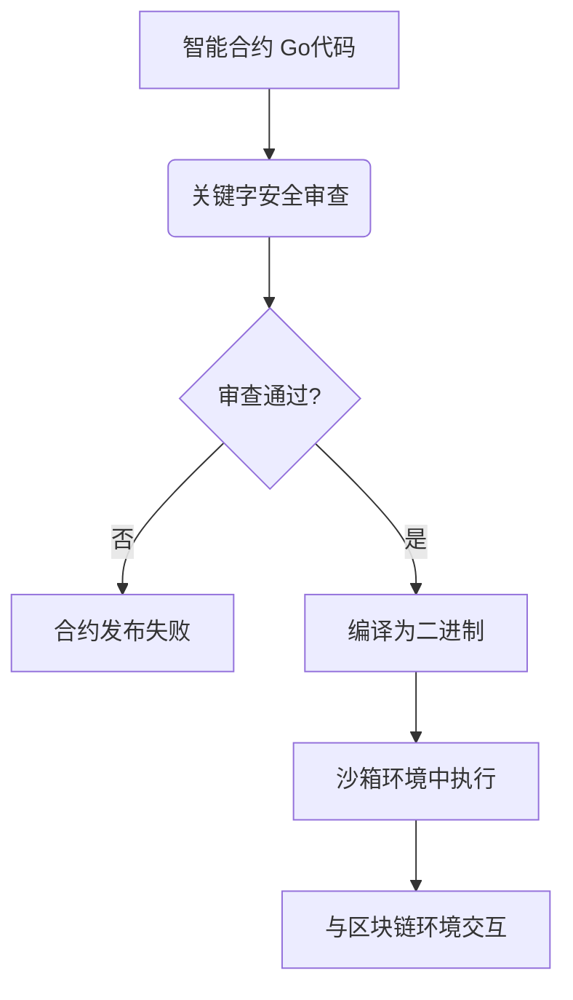

# 智能合约虚拟机架构设计文档

## 1. 项目概述

### 1.1 项目背景
本项目旨在构建一个基于 Golang 的智能合约虚拟机（Smart Contract Virtual Machine），允许开发者直接使用原生 Golang 代码编写智能合约，而非传统的编译后二进制格式或特定领域语言（DSL）。

### 1.2 设计理念
- **源码即合约**：智能合约本身就是 Golang 代码，而不是二进制程序
- **安全优先**：通过关键字限制和导入控制确保执行安全性
- **开发友好**：降低智能合约开发门槛，让熟悉 Go 语言的开发者无缝接入
- **兼容性设计**：复用Golang编译器和TinyGo编译器，确保不同版本的兼容性

## 2. 系统架构

### 2.1 总体架构


### 2.2 核心组件

#### 2.2.1 虚拟机执行引擎
- 负责解析、编译和执行 Golang 智能合约代码
- 管理合约代码的生命周期
- 提供与外部系统交互的接口

#### 2.2.2 关键字安全审查系统
- 在合约执行前进行静态分析
- 审查并禁止使用危险关键字（如 `unsafe`, `os`, `syscall` 等）
- 检查导入列表，仅允许导入指定的安全库

#### 2.2.3 沙箱隔离环境
- 提供严格受限的运行环境
- 防止合约访问宿主系统的文件、网络或其他敏感资源
- 确保合约执行的安全性和隔离性

#### 2.2.4 默认库接口
提供与区块链环境交互的基础接口：
- 区块链信息相关接口
- 账户操作相关接口
- 对象存储相关接口
- 跨合约调用接口
- 日志和事件接口

## 3. 安全机制

### 3.1 关键字限制
定义明确的关键字白名单，包括基本类型关键字、控制流关键字等，确保不同Golang版本的兼容性并复用现有编译器。

### 3.2 导入控制
合约只能导入指定的安全库，采用白名单机制，禁止导入白名单以外的任何包：
- `fmt`: 格式化输入输出
- `strconv`: 字符串转换
- `math`: 数学计算
- `time`: 时间处理
- `errors`: 错误处理
- `github.com/lengzhao/vm`: 项目默认库，提供与区块链环境交互的接口

### 3.3 默认函数限制
为了确保合约的安全性和兼容性，只允许使用白名单中定义的默认函数。

### 3.4 执行环境隔离
通过沙箱机制限制合约对系统资源的访问，确保执行环境的安全性。

### 3.5 Gas计费机制
Gas计费系统从两个维度实现资源控制：
1. 代码行计费：在合约编译阶段，通过AddGasConsumption函数自动在代码中插入Gas消耗点，每个代码块开始处注入Gas消耗代码，每行代码执行消耗1点gas
2. 接口操作计费：所有的包函数调用都有固定的gas消耗，基础操作消耗较少gas，存储操作消耗较多gas，合约调用等高级操作有额外的gas预留机制

### 3.6 对象存储并发控制
智能合约对象存储机制支持两种执行模式：
1. 统一账户系统：所有信息保存到默认Object，类似EVM，需串行执行
2. 并行执行支持：为不同用户创建不同Object，通过对象隔离实现交易并行执行

## 4. 模块设计

### 4.1 目录结构
```
vm/
├── go.mod                 # Go模块定义文件
├── go.sum                 # 依赖校验文件
├── engine.go              # 虚拟机执行引擎，作为开源库的入口
├── vm/                    # 虚拟机核心逻辑
│   └── engine.go          # 执行引擎实现
├── contract/              # 合约管理相关功能
│   ├── compiler.go        # 合约编译器
│   └── analyzer.go        # 合约代码分析器（安全审查）
├── sandbox/               # 沙箱环境实现
│   └── sandbox.go         # 沙箱配置与管理
├── docs/                  # 设计文档
│   └── architecture.md    # 架构设计文档
└── README.md              # 项目说明
```

### 4.2 核心功能模块

1. **虚拟机执行引擎**：负责解析、编译和执行Golang智能合约代码
2. **Golang合约编译与加载机制**：在运行时安全地编译和加载合约代码
3. **关键字安全审查系统**：在合约执行前进行静态分析，审查并禁止使用危险关键字
4. **沙箱隔离环境**：提供严格受限的运行环境，防止合约访问敏感资源

## 5. 执行环境

### 5.1 编译执行
- 合约编译时进行AST解析，检查import列表和关键字
- 通过限制引用库，可将源码编译成二进制文件本地执行
- 使用tinygo编译使可执行文件更小

### 5.2 数据交互
- 交易数据采用JSON格式，包含完整函数名和参数
- 无需定义标准函数签名

## 6. 默认库接口规范

### 6.1 区块链信息相关接口
- `BlockHeight() uint64`      // 获取当前区块高度
- `BlockTime() int64`         // 获取当前区块时间戳
- `ContractAddress() Address` // 获取当前合约地址

### 6.2 账户操作相关接口
- `Sender() Address`                                // 获取交易发送方或合约调用方
- `Balance(addr Address) uint64`                    // 获取账户余额
- `Transfer(from, to Address, amount uint64) error` // 转账操作

### 6.3 对象存储相关接口
- `CreateObject() Object`                             // 创建新对象，失败时panic
- `GetObject(id ObjectID) (Object, error)`            // 获取指定对象，可能返回error
- `GetObjectWithOwner(owner Address) (Object, error)` // 根据所有者获取对象，可能返回error
- `DeleteObject(id ObjectID)`                         // 删除对象，失败时panic

### 6.4 跨合约调用接口
- `Call(contract Address, function string, args ...any) ([]byte, error)`

### 6.5 日志和事件接口
- `Log(eventName string, keyValues ...any)` // 记录事件

### 6.6 Object接口
```go
type Object interface {
  ID() ObjectID          // 获取对象ID
  Owner() Address        // 获取对象所有者
  Contract() Address     // 获取对象所属合约
  SetOwner(addr Address) // 设置对象所有者，失败时panic

  // 字段操作
  Get(field string, value any) error // 获取字段值
  Set(field string, value any) error // 设置字段值
}
```