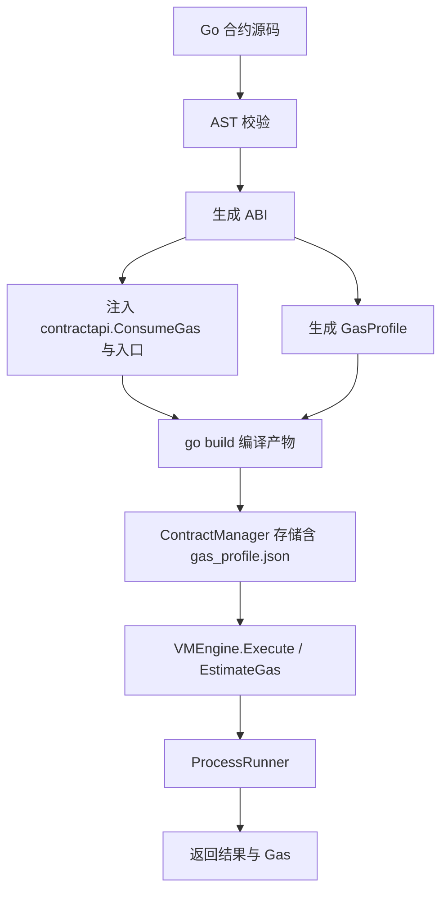

# 智能合约虚拟机架构设计文档

## 1. 项目概述

### 1.1 项目背景
本项目旨在构建一个基于 Golang 的智能合约虚拟机（Smart Contract Virtual Machine），允许开发者直接使用原生 Golang 代码编写智能合约，而非传统的编译后二进制格式或特定领域语言（DSL）。

### 1.2 设计理念
- **源码即合约**：智能合约本身就是 Golang 代码，而不是二进制程序
- **安全优先**：通过关键字限制和导入控制确保执行安全性
- **开发友好**：降低智能合约开发门槛，让熟悉 Go 语言的开发者无缝接入
- **可执行流水线优先**：先打通 Compile → Deploy → Execute，再演进复杂沙箱与 Host Runtime

## 2. 系统架构

### 2.1 总体架构
当前阶段以可执行合约流水线为核心，而不是过早拆分过多独立子系统：


```mermaid
flowchart TD
    Source[Go 合约源码] --> Validate[AST 校验]
    Validate --> ABI[生成 ABI]
    ABI --> Profile[生成 GasProfile]
    ABI --> Gas[注入 contractapi.ConsumeGas 与入口]
    Gas --> Build[go build 编译产物]
    Profile --> Build
    Build --> Store[ContractManager 存储含 gas_profile.json]
    Store --> Execute[VMEngine.Execute / EstimateGas]
    Execute --> Runner[ProcessRunner]
    Runner --> Result[返回结果与 Gas]
```

### 2.2 核心边界

保留并明确以下边界：

1. **VMEngine**：外部入口，只负责编排
2. **ContractCompiler**：源码到 `CompiledContract`
3. **Runner**：执行已编译合约产物
4. **ContractManager**：部署、存储、加载合约元数据和产物
5. **ABIGenerator**：从 AST 提取 ABI，作为编译流水线一环
6. **SecurityReviewer**：Import/危险节点/包级可变状态审查
7. **GasMetering**：宿主侧计量；合约侧统一到 `contractapi`；`EstimateGas` 静态 + DryRun

### 2.3 当前阶段后置能力
以下能力保留设计方向，但不作为当前主链路阻塞项：
- 完整系统调用沙箱 / Docker 隔离
- Object 存储、跨合约 Call、完整链状态读写（含对应 Gas）
- 合约升级、并行调度框架
- TinyGo 作为默认构建器（当前默认 `go build`，可后续切换）

## 3. 安全机制

### 3.1 导入控制
合约只能导入白名单包：
- `fmt`、`strconv`、`math`、`time`、`errors`
- `github.com/lengzhao/vm/contractapi`（合约侧默认库）
- **禁止** `github.com/lengzhao/vm`（宿主根包）

### 3.2 危险构造禁止
通过 AST 拒绝：
- `unsafe`、`go`、`select`、`chan`、`goto`、`map`、`cap`
- 包级可变全局变量（`var`）；常量允许

### 3.3 Gas 计费（已实现）
- 执行入口固定基础 Gas（10）；函数入口 / 循环迭代各 1
- 编译期注入 `contractapi.ConsumeGas`；只读上下文与 `Log` 按表扣费
- Deploy 落盘 `gas_profile.json`；`EstimateGas` 支持静态保守上界与可选 DryRun
- 子进程通过 `VM_GAS_LIMIT` 接收上限，结果 JSON 回报消耗
- Object / Call Gas：**后置**

### 3.4 执行隔离（MVP）
- 使用独立进程 + 超时执行
- 子进程仅注入最小环境（`PATH` + `VM_*`），不继承完整宿主环境
- 复杂沙箱后置

### 3.5 编译缓存
- 产物路径按源码指纹 + `compilerBuildID` 命名；命中则跳过 `go build`
- 构建时内嵌 `contractapi` 源码（`//go:embed`），本地 `replace`，无需每次 `go mod tidy`

## 4. 模块与目录

当前实现采用扁平 `package vm`（不含 `internal`）：

```text
vm/
├── engine.go           # VMEngine 编排入口
├── compiler.go         # 编译流水线（含缓存）
├── compiler_embed.go   # 内嵌 contractapi
├── runner.go           # ProcessRunner
├── host.go             # Host / CallContext / Event
├── security.go         # 安全审查
├── gas.go              # 宿主 Gas 计量
├── gas_profile.go      # GasProfile 扫描与静态估算
├── contract.go         # 合约存储管理（含 gas_profile.json）
├── contractapi/        # 合约侧默认库 + Gas 计数器
├── abi/                # ABI 提取
└── docs/               # 设计文档
```

## 5. 执行与数据交互

### 5.1 合约源码约束
- 合约源码不得包含 `main`；由编译器生成入口
- 仅支持导出函数作为可调用接口

### 5.2 调用格式
Runner 通过 stdin 传入 JSON：

```json
{
  "function": "Add",
  "args": [10, 20]
}
```

合约 stdout 返回：

```json
{
  "ok": true,
  "result": 30,
  "gas": 11
}
```

## 6. 详细设计文档参考

- [模块化架构设计](modular_architecture_design.md)
- [合约处理流程](detailed_design/contract_processing_flow.md)
- [虚拟机执行引擎详细设计](detailed_design/vm_engine_detailed_design.md)
- [执行环境设计](execution_environment.md)
- [默认库接口规范](default_library.md)
- [安全审查规范](security_review.md)
- [Gas计费机制](gas_metering.md)
- [ABI生成与关键字处理](abi_generation.md)
