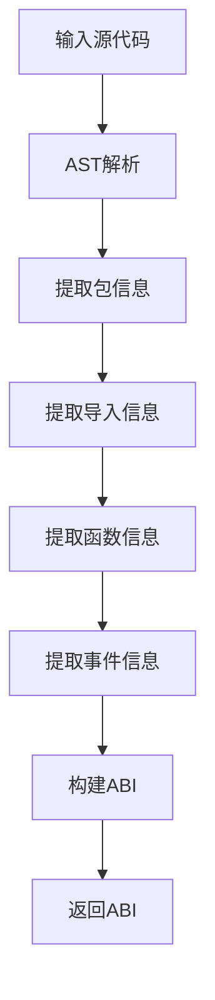

# ABI生成模块详细设计文档

## 1. 引言

### 1.1 编写目的
本文档详细描述ABI生成模块的简化设计与实现，确保智能合约接口信息的正确提取和序列化。

### 1.2 术语定义
- ABIGenerator: ABI生成器
- ABI: Application Binary Interface，应用程序二进制接口

## 2. 概述

### 2.1 功能概述
ABI生成模块在合约编译阶段自动生成接口信息，包括：
- 公开函数列表
- 函数参数和返回值类型
- 事件定义

## 3. 详细设计

### 3.1 核心数据结构

#### 3.1.1 ABI 结构
```go
type ABI struct {
    PackageName string     `json:"package_name,omitempty"`
    Imports     []Import   `json:"imports,omitempty"`
    Functions   []Function `json:"functions,omitempty"`
    Events      []Event    `json:"events,omitempty"`
}
```

#### 3.1.2 Import 结构
```go
type Import struct {
    Path string `json:"path,omitempty"` // 导入路径
    Name string `json:"name,omitempty"` // 别名（如果有）
}
```

#### 3.1.3 Function 结构
```go
type Function struct {
    Name    string      `json:"name,omitempty"`
    Inputs  []Parameter `json:"inputs,omitempty"`
    Outputs []Parameter `json:"outputs,omitempty"`
}
```

#### 3.1.4 Event 结构
```go
type Event struct {
    Name       string      `json:"name,omitempty"`
    Parameters []Parameter `json:"parameters,omitempty"`
}
```

#### 3.1.5 Parameter 结构
```go
type Parameter struct {
    Name string `json:"name,omitempty"`
    Type string `json:"type,omitempty"`
}
```

### 3.2 核心接口设计

#### 3.2.1 ABIGenerator 接口
```go
// ABIGenerator ABI生成模块接口（与架构文档保持一致）
// 根据简化设计原则，接口已精简为核心功能
type ABIGenerator interface {
    // Generate 从源代码生成ABI
    Generate(sourceCode string) (ABI, error)
}
```

### 3.3 核心功能实现

#### 3.3.1 ABI生成流程


#### 3.3.2 函数识别规则
- 以大写字母开头的函数为公开函数
- 跳过有接收者的方法（仅处理包级函数）
- 提取函数的输入参数和输出参数

#### 3.3.3 事件识别规则
- 通过分析函数体中的`ctx.Log`调用来识别事件
- 提取事件名称和参数信息

## 4. 实现细节

### 4.1 AST解析
使用Go标准库的`go/parser`包解析源代码为AST：
```go
fset := token.NewFileSet()
file, err := parser.ParseFile(fset, "", code, parser.AllErrors)
```

### 4.2 类型字符串转换
实现`getTypeString`函数将AST表达式转换为字符串表示：
- 基本类型（int, string, bool等）
- 指针类型（*T）
- 数组和切片类型（[]T）
- 映射类型（map[K]V）
- 结构体和接口类型

### 4.3 参数提取
实现`extractParameters`函数从字段列表中提取参数信息：
- 处理命名参数和未命名参数
- 提取参数类型信息

### 4.4 事件提取
实现`extractEventsFromFunction`函数从函数体中提取事件：
- 查找`ctx.Log`调用
- 提取事件名称和参数

## 5. 错误处理

### 5.1 错误类型
- 源代码解析错误
- 函数识别错误
- 类型分析错误

### 5.2 错误处理策略
- 遇到错误时立即返回错误信息
- 提供清晰的错误描述

## 6. 与其他模块的交互

### 6.1 与虚拟机引擎的交互
ABI生成模块作为虚拟机引擎的一个组件，在编译阶段被调用生成ABI。

### 6.2 与编译器模块的交互
ABI生成与合约编译过程集成，在编译过程中提取接口信息。

## 7. 附录

### 7.1 ABI JSON格式示例
```json
{
  "package_name": "main",
  "imports": [
    {
      "path": "fmt"
    }
  ],
  "functions": [
    {
      "name": "Add",
      "inputs": [
        {
          "name": "a",
          "type": "int"
        },
        {
          "name": "b",
          "type": "int"
        }
      ],
      "outputs": [
        {
          "name": "",
          "type": "int"
        }
      ]
    }
  ],
  "events": [
    {
      "name": "AddEvent",
      "parameters": [
        {
          "name": "result",
          "type": ""
        }
      ]
    }
  ]
}
```