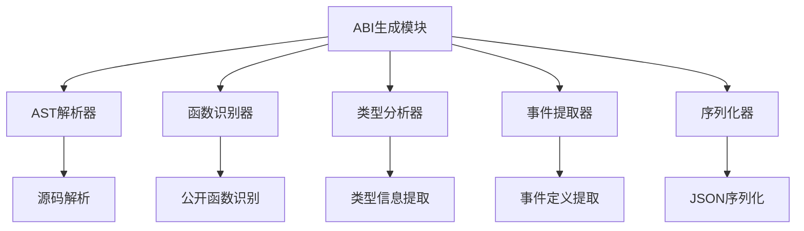
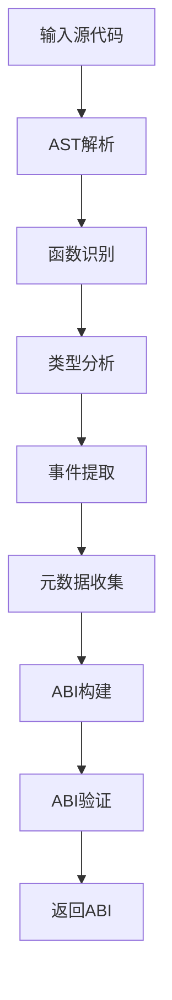
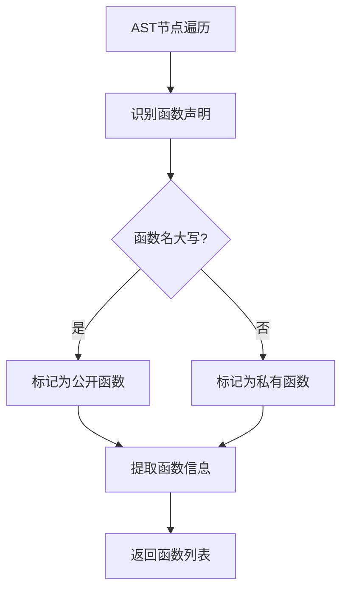
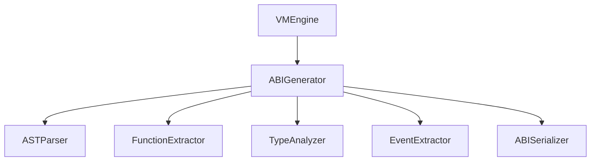

# ABI生成模块详细设计文档

## 1. 引言

### 1.1 编写目的
本文档详细描述ABI生成模块的设计与实现，确保智能合约接口信息的正确提取和序列化。此版本基于模块化架构设计进行了更新。

### 1.2 术语定义
- ABIGenerator: ABI生成器
- ABI: Application Binary Interface，应用程序二进制接口
- AST: Abstract Syntax Tree，抽象语法树
- Serialization: 序列化

## 2. 概述

### 2.1 功能概述
ABI生成模块在合约编译阶段自动生成接口信息，包括：
- 函数列表
- 参数类型和返回值类型
- 事件定义
- 合约元数据

### 2.2 架构图


## 3. 详细设计

### 3.1 核心数据结构

#### 3.1.1 ABIGenerator 结构体
```go
type ABIGenerator struct {
    config     ABIConfig
    parser     ASTParser
    extractor  FunctionExtractor
    analyzer   TypeAnalyzer
    serializer ABISerializer
}
```

#### 3.1.2 ABIConfig 配置结构
```go
type ABIConfig struct {
    // 是否验证生成的ABI
    ValidateABI bool
    
    // 是否包含私有函数信息
    IncludePrivateFunctions bool
    
    // 是否包含详细类型信息
    IncludeDetailedTypes bool
    
    // 输出格式
    OutputFormat OutputFormat
}
```

#### 3.1.3 ABI 结构
```go
type ABI struct {
    // 合约名称
    Name string `json:"name"`
    
    // 合约版本
    Version string `json:"version"`
    
    // 函数列表
    Functions []Function `json:"functions"`
    
    // 事件列表
    Events []Event `json:"events"`
    
    // 合约元数据
    Metadata Metadata `json:"metadata"`
    
    // 生成时间
    GeneratedAt time.Time `json:"generated_at"`
}
```

### 3.2 核心接口设计

#### 3.2.1 ABIGenerator 接口
```go
// ABIGenerator ABI生成模块接口（与架构文档保持一致）
type ABIGenerator interface {
    // Generate 从源代码生成ABI
    Generate(sourceCode string) (*ABI, error)
    
    // Validate 验证ABI的正确性
    Validate(abi *ABI) error
    
    // Serialize 序列化ABI
    Serialize(abi *ABI) ([]byte, error)
}
```

### 3.3 核心功能实现

#### 3.3.1 ABI生成流程


#### 3.3.2 函数识别流程


## 4. 模块设计

### 4.1 AST解析器模块

#### 4.1.1 功能描述
负责将源代码解析为抽象语法树(AST)，为后续分析提供结构化数据。

#### 4.1.2 接口设计
```go
type ASTParser interface {
    // Parse 解析源代码为AST
    Parse(sourceCode string) (*ast.File, error)
    
    // ParseFile 解析文件为AST
    ParseFile(filename string) (*ast.File, error)
    
    // GetPackageInfo 获取包信息
    GetPackageInfo(file *ast.File) *PackageInfo
}
```

### 4.2 函数识别器模块

#### 4.2.1 功能描述
识别合约中的函数声明，区分公开函数和私有函数。

#### 4.2.2 接口设计
```go
type FunctionExtractor interface {
    // ExtractFunctions 提取函数
    ExtractFunctions(file *ast.File) ([]Function, error)
    
    // IsPublicFunction 检查是否为公开函数
    IsPublicFunction(name string) bool
    
    // ExtractFunctionInfo 提取函数详细信息
    ExtractFunctionInfo(funcDecl *ast.FuncDecl) (*Function, error)
}
```

#### 4.2.3 函数信息结构
```go
type Function struct {
    // 函数名称
    Name string `json:"name"`
    
    // 参数列表
    Inputs []Parameter `json:"inputs"`
    
    // 返回值列表
    Outputs []Parameter `json:"outputs"`
    
    // 是否为公开函数
    Public bool `json:"public"`
    
    // 函数修饰符
    StateMutability StateMutability `json:"state_mutability"`
    
    // Gas预估
    GasEstimate uint64 `json:"gas_estimate"`
    
    // 函数文档
    Documentation string `json:"documentation"`
}
```

### 4.3 类型分析器模块

#### 4.3.1 功能描述
分析函数参数和返回值的类型信息。

#### 4.3.2 接口设计
```go
type TypeAnalyzer interface {
    // AnalyzeType 分析类型
    AnalyzeType(expr ast.Expr) (*Type, error)
    
    // GetTypeName 获取类型名称
    GetTypeName(expr ast.Expr) string
    
    // IsBasicType 检查是否为基础类型
    IsBasicType(typeName string) bool
    
    // GetBasicTypeMapping 获取基础类型映射
    GetBasicTypeMapping() map[string]string
}
```

#### 4.3.3 参数结构
```go
type Parameter struct {
    // 参数名称
    Name string `json:"name"`
    
    // 参数类型
    Type string `json:"type"`
    
    // 参数索引
    Index int `json:"index"`
    
    // 是否为可变参数
    Variadic bool `json:"variadic"`
}
```

### 4.4 事件提取器模块

#### 4.4.1 功能描述
提取合约中的事件定义。

#### 4.4.2 接口设计
```go
type EventExtractor interface {
    // ExtractEvents 提取事件
    ExtractEvents(file *ast.File) ([]Event, error)
    
    // ExtractEventInfo 提取事件详细信息
    ExtractEventInfo(callExpr *ast.CallExpr) (*Event, error)
}
```

#### 4.4.3 事件结构
```go
type Event struct {
    // 事件名称
    Name string `json:"name"`
    
    // 事件参数
    Parameters []Parameter `json:"parameters"`
    
    // 是否为匿名事件
    Anonymous bool `json:"anonymous"`
    
    // 事件文档
    Documentation string `json:"documentation"`
}
```

### 4.5 序列化器模块

#### 4.5.1 功能描述
将ABI信息序列化为JSON格式。

#### 4.5.2 接口设计
```go
type ABISerializer interface {
    // Serialize 序列化ABI
    Serialize(abi *ABI) ([]byte, error)
    
    // Deserialize 反序列化ABI
    Deserialize(data []byte) (*ABI, error)
    
    // ValidateFormat 验证格式
    ValidateFormat(data []byte) error
}
```

## 5. 类型系统设计

### 5.1 基础类型映射
```go
var basicTypeMapping = map[string]string{
    "int":        "int256",
    "int8":       "int8",
    "int16":      "int16",
    "int32":      "int32",
    "int64":      "int64",
    "uint":       "uint256",
    "uint8":      "uint8",
    "uint16":     "uint16",
    "uint32":     "uint32",
    "uint64":     "uint64",
    "float32":    "float32",
    "float64":    "float64",
    "string":     "string",
    "bool":       "bool",
    "byte":       "byte",
    "rune":       "rune",
    "[]byte":     "bytes",
    "[]string":   "string[]",
    "[]int":      "int256[]",
    "[]uint":     "uint256[]",
    "map[string]string": "mapping(string=>string)",
}
```

### 5.2 复杂类型处理
- 结构体类型
- 接口类型
- 函数类型
- 通道类型（不支持）

### 5.3 类型验证
```go
type TypeValidator interface {
    // ValidateType 验证类型是否支持
    ValidateType(typeName string) error
    
    // IsSupportedType 检查类型是否被支持
    IsSupportedType(typeName string) bool
    
    // GetSupportedTypes 获取支持的类型列表
    GetSupportedTypes() []string
}
```

## 6. 安全设计

### 6.1 输入验证
严格验证输入源代码，防止恶意代码注入。

### 6.2 输出验证
验证生成的ABI格式正确性，防止错误信息传播。

### 6.3 类型安全
确保只生成支持的类型信息，防止不安全类型暴露。

## 7. 性能优化

### 7.1 AST缓存
对已解析的AST进行缓存，避免重复解析。

### 7.2 ABI缓存
对已生成的ABI进行缓存，避免重复生成。

### 7.3 并行处理
支持对多个合约同时进行ABI生成。

## 8. 错误处理

### 8.1 错误分类
- 解析错误
- 类型错误
- 验证错误
- 序列化错误

### 8.2 错误码设计
```go
const (
    // 解析相关错误
    ErrParseFailed = 1001
    ErrInvalidSyntax = 1002
    
    // 类型相关错误
    ErrUnknownType = 2001
    ErrUnsupportedType = 2002
    ErrTypeMismatch = 2003
    
    // 验证相关错误
    ErrValidationFailed = 3001
    ErrInvalidFunction = 3002
    ErrInvalidEvent = 3003
    
    // 序列化相关错误
    ErrSerializationFailed = 4001
    ErrInvalidFormat = 4002
    
    // 系统相关错误
    ErrSystemError = 5001
)
```

### 8.3 错误信息结构
```go
type ABIError struct {
    Code     int
    Message  string
    Position ast.Position // 错误位置
    Details  string       // 详细信息
    Err      error
}
```

## 9. 测试设计

### 9.1 单元测试
为每个ABI生成模块编写单元测试，确保功能正确性。

### 9.2 集成测试
编写集成测试，验证整个ABI生成流程的正确性。

### 9.3 兼容性测试
测试不同Go版本和语法特性的兼容性。

### 9.4 性能测试
编写性能测试，验证ABI生成器的性能指标。

## 10. 部署与运维

### 10.1 配置管理
```yaml
abi:
  validate: true
  include_private: false
  include_detailed_types: true
  output_format: "json"
  cache_enabled: true
  cache_size: 10000
```

### 10.2 监控指标
- ABI生成成功率
- 平均生成时间
- 类型识别准确率
- 缓存命中率

### 10.3 性能调优
```go
type ABIGeneratorStats struct {
    TotalGenerated uint64
    CacheHits      uint64
    AverageTime    time.Duration
    ErrorCount     uint64
}
```

## 11. 与其他模块的交互

### 11.1 与虚拟机引擎的交互
```go
// VMEngineConfig 虚拟机引擎配置
type VMEngineConfig struct {
    ABIGenerator       ABIGenerator  // ABI生成模块
    // 其他模块...
}
```

### 11.2 与编译器模块的交互
ABI生成模块需要与编译器模块协作，在编译过程中生成ABI。

### 11.3 数据传输对象
```go
// ABI生成请求
type GenerateABIRequest struct {
    SourceCode string
    Options    ABIGenerateOptions
}

// ABI生成响应
type GenerateABIResponse struct {
    ABI   *ABI
    Error error
}
```

## 12. 附录

### 12.1 ABI JSON格式示例
```json
{
  "name": "TokenContract",
  "hash": "0x1234567890abcdef1245",
  "address": "0x1234567890abcdef",
  "functions": [
    {
      "name": "Transfer",
      "inputs": [
        {
          "name": "to",
          "type": "address",
          "index": 0
        },
        {
          "name": "amount",
          "type": "uint256",
          "index": 1
        }
      ],
      "outputs": [
        {
          "name": "success",
          "type": "bool"
        }
      ]
    }
  ],
  "events": [
    {
      "name": "Transfer",
      "parameters": [
        {
          "name": "from",
          "type": "address"
        },
        {
          "name": "to",
          "type": "address"
        },
        {
          "name": "amount",
          "type": "uint256"
        }
      ],
      "anonymous": false
    }
  ]
}
```

### 12.2 接口依赖关系
