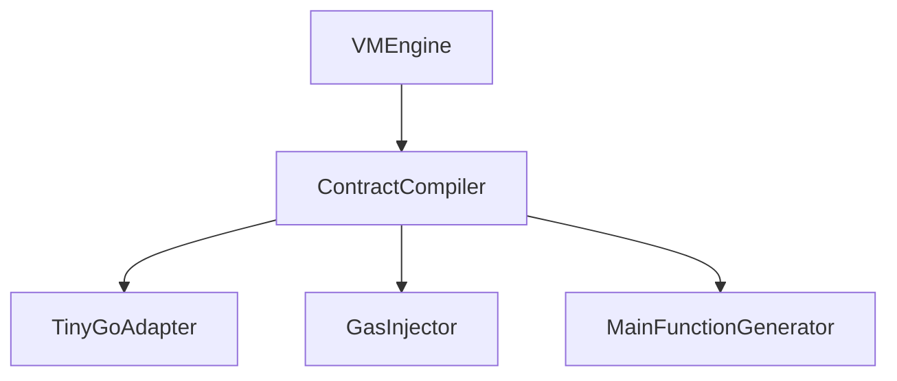

# 编译器模块详细设计文档

## 1. 引言

### 1.1 编写目的
本文档详细描述编译器模块的设计与实现，确保智能合约能够正确编译为可执行文件。此版本基于模块化架构设计进行了更新。

### 1.2 术语定义
- ContractCompiler: 合约编译器
- TinyGo: Go语言的嵌入式系统编译器
- AST: Abstract Syntax Tree，抽象语法树
- Gas Injection: Gas注入

## 2. 概述

### 2.1 功能概述
编译器模块负责将经过安全审查的Golang智能合约源代码编译为可执行文件，包括：
- 使用TinyGo编译器进行编译
- 注入Gas计费代码
- 生成Main函数
- 生成可执行文件

### 2.2 架构图
``mermaid
graph TD
A[编译器模块] --> B[TinyGo编译器适配器]
A --> C[Gas注入器]
A --> D[Main函数生成器]
B --> E[TinyGo编译器]
C --> F[AST分析器]
D --> G[函数识别器]
```

## 3. 详细设计

### 3.1 核心数据结构

#### 3.1.1 ContractCompiler 结构体
```go
type ContractCompiler struct {
    config CompilerConfig
    gasInjector *GasInjector
    mainGenerator *MainFunctionGenerator
    tinyGoAdapter *TinyGoAdapter
}
```

#### 3.1.2 CompilerConfig 配置结构
```go
type CompilerConfig struct {
    // 是否启用Gas注入
    EnableGasInjection bool
    
    // TinyGo编译器路径
    TinyGoPath string
    
    // 编译输出目录
    OutputDir string
    
    // 编译优化级别
    OptimizationLevel int
    
    // 是否启用缓存
    EnableCache bool
}
```

#### 3.1.3 CompilationResult 编译结果
```go
type CompilationResult struct {
    // 编译后的合约
    Contract CompiledContract
    
    // 编译日志
    Logs []string
    
    // 编译是否成功
    Success bool
    
    // 错误信息
    Error error
    
    // 编译时间
    CompileTime time.Duration
}
```

### 3.2 核心接口设计

#### 3.2.1 ContractCompiler 接口
```go
// ContractCompiler 编译器模块接口（与架构文档保持一致）
// 根据简化设计原则，接口已精简为核心功能
type ContractCompiler interface {
    // Compile 编译源代码
    Compile(sourceCode string) (CompiledContract, error)
    
    // Validate 验证源代码
    Validate(sourceCode string) error
}
```

### 3.3 核心功能实现

#### 3.3.1 编译流程
``mermaid
graph TD
A[输入源代码] --> B[源代码验证]
B --> C[Gas代码注入]
C --> D[Main函数生成]
D --> E[TinyGo编译]
E --> F[生成可执行文件]
F --> G[生成ABI]
G --> H[返回编译结果]
```

#### 3.3.2 Gas注入流程
``mermaid
graph TD
A[源代码] --> B[AST分析]
B --> C[识别代码块]
C --> D[注入Gas消耗代码]
D --> E[返回注入后的代码]
```

#### 3.3.3 Main函数生成流程
``mermaid
graph TD
A[源代码] --> B[函数识别]
B --> C[生成Main函数]
C --> D[返回完整代码]
```

## 4. 模块设计

### 4.1 TinyGo编译器适配器模块

#### 4.1.1 功能描述
负责调用TinyGo编译器将Go源代码编译为可执行文件。

#### 4.1.2 接口设计
```go
type TinyGoAdapter interface {
    // Compile 使用TinyGo编译源代码
    Compile(sourceFile string, outputFile string) error
    
    // GetVersion 获取TinyGo版本
    GetVersion() (string, error)
    
    // SetOptions 设置编译选项
    SetOptions(options CompileOptions)
}
```

#### 4.1.3 实现细节
1. 调用TinyGo命令行工具进行编译
2. 处理编译过程中的错误和警告
3. 优化生成的可执行文件大小

### 4.2 Gas注入器模块

#### 4.2.1 功能描述
在编译前向源代码中注入Gas计费代码。

#### 4.2.2 接口设计
```go
type GasInjector interface {
    // InjectGas 在代码中注入Gas消耗
    InjectGas(sourceCode string) (string, error)
    
    // EstimateGas 预估Gas消耗
    EstimateGas(sourceCode string) (uint64, error)
    
    // SetGasModel 设置Gas模型
    SetGasModel(model GasModel)
}
```

#### 4.2.3 实现细节
1. 使用AST分析识别代码块和函数调用
2. 在适当位置插入Gas消耗代码
3. 确保Gas计量不会影响合约逻辑正确性

### 4.3 Main函数生成器模块

#### 4.3.1 功能描述
为Go源代码生成Main函数，使其能够独立执行。

#### 4.3.2 接口设计
```go
type MainFunctionGenerator interface {
    // GenerateMain 生成Main函数
    GenerateMain(sourceCode string) (string, error)
    
    // ExtractPublicFunctions 提取公开函数
    ExtractPublicFunctions(sourceCode string) ([]FunctionInfo, error)
    
    // GenerateFunctionDispatcher 生成函数分发器
    GenerateFunctionDispatcher(functions []FunctionInfo) string
}
```

#### 4.3.3 实现细节
1. 分析合约中的公开函数
2. 生成Main函数，提供函数调用入口
3. 实现参数解析和结果返回机制

## 5. 编译优化

### 5.1 编译缓存
```go
type CompileCache struct {
    cache map[string]*CompilationResult
    mutex sync.RWMutex
}
```

### 5.2 增量编译
支持对未修改的代码使用缓存结果，提高编译效率。

### 5.3 并行编译
支持多个合约同时编译，提高系统吞吐量。

## 6. 错误处理

### 6.1 错误分类
- 语法错误
- 编译错误
- Gas注入错误
- 系统错误

### 6.2 错误码设计
```go
const (
    // 语法相关错误
    ErrInvalidSyntax = 1001
    ErrParseFailed = 1002
    
    // 编译相关错误
    ErrCompileFailed = 2001
    ErrTinyGoNotFound = 2002
    ErrCompileTimeout = 2003
    
    // Gas注入相关错误
    ErrGasInjectionFailed = 3001
    ErrGasEstimationFailed = 3002
    
    // Main函数生成错误
    ErrMainFunctionGeneration = 4001
    
    // 系统相关错误
    ErrSystemError = 5001
    ErrFileOperationFailed = 5002
)
```

### 6.3 错误信息结构
```go
type CompileError struct {
    Code     int
    Message  string
    Position ast.Position // 错误位置
    Details  string
    Err      error
}
```

## 7. 安全设计

### 7.1 输入验证
严格验证输入源代码，防止恶意代码注入。

### 7.2 输出验证
验证生成的可执行文件格式正确性。

### 7.3 资源限制
限制编译过程中的资源使用，防止资源耗尽攻击。

## 8. 性能优化

### 8.1 编译缓存
对已编译的合约进行缓存，避免重复编译。

### 8.2 并行处理
支持多个合约同时编译。

### 8.3 增量编译
只对修改的部分进行重新编译。

## 9. 测试设计

### 9.1 单元测试
为每个编译模块编写单元测试，确保功能正确性。

### 9.2 集成测试
编写集成测试，验证整个编译流程的正确性。

### 9.3 性能测试
编写性能测试，验证编译器的性能指标。

## 10. 部署与运维

### 10.1 系统要求
- Go 1.16+
- TinyGo 0.20+
- Linux/Unix 环境

### 10.2 配置管理
``yaml
compiler:
  enable_gas_injection: true
  tinygo_path: "/usr/local/bin/tinygo"
  output_dir: "./compiled_contracts"
  optimization_level: 2
  enable_cache: true
  cache_size: 1000
```

### 10.3 监控指标
- 编译成功率
- 平均编译时间
- 缓存命中率
- Gas注入成功率

## 11. 与其他模块的交互

### 11.1 与虚拟机引擎的交互
```go
// VMEngineConfig 虚拟机引擎配置
type VMEngineConfig struct {
    ContractCompiler   ContractCompiler  // 编译器模块
    // 其他模块...
}
```

### 11.2 与安全审查模块的交互
编译器模块在编译前需要确保源代码已通过安全审查。

### 11.3 数据传输对象
```go
// 编译请求
type CompileRequest struct {
    SourceCode string
    Options    CompileOptions
}

// 编译响应
type CompileResponse struct {
    Result *CompilationResult
    Error  error
}
```

## 12. 附录

### 12.1 编译选项
```go
type CompileOptions struct {
    // 目标平台
    Target string
    
    // 优化级别
    OptimizationLevel int
    
    // 是否启用调试信息
    DebugInfo bool
    
    // 自定义编译标志
    CustomFlags []string
}
```

### 12.2 Gas模型
```go
type GasModel struct {
    // 基础操作Gas消耗
    BaseOperationCost map[string]uint64
    
    // 函数调用Gas消耗
    FunctionCallCost map[string]uint64
    
    // 存储操作Gas消耗
    StorageOperationCost map[string]uint64
}
```

### 12.3 接口依赖关系
