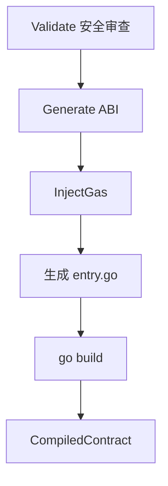

# 编译器模块详细设计

## 1. 概述

`ContractCompiler` 负责把合约源码变成可执行产物。当前默认构建器是 **`go build`**；TinyGo 为后置可选适配。

## 2. 流水线


```mermaid
flowchart TD
    A[Validate 安全审查] --> B[Generate ABI]
    B --> C[InjectGas]
    C --> D[生成 entry.go]
    D --> E[go build]
    E --> F[CompiledContract]
```

## 3. 接口

```go
type ContractCompiler interface {
    Compile(sourceCode string) (*CompiledContract, error)
    Validate(sourceCode string) error
    InjectGas(sourceCode string) (string, error)
}
```

实现：`ContractCompilerImpl`（见 `compiler.go`）。

## 4. Gas 注入（MVP）

在 AST 中插入 `__vmConsumeGas(n)`：

- 每个函数入口
- `for` / `range` 循环体开头

入口基础 Gas 在 `entry.go` 中消耗（当前 10）。

## 5. 入口生成

- 合约源码不得包含 `main`
- 编译器生成独立 `entry.go`：解析 stdin JSON、按函数名分发、输出 JSON 结果与 Gas
- 支持参数类型：`int` / `int64` / `uint64` / `float64` / `string` / `bool`

## 6. 构建产物

临时目录结构：

```text
build_<hash>/
  go.mod
  contract.go   # Gas 注入后源码，package main
  entry.go      # 框架入口
```

输出：`contract_<hash>` 可执行文件。

## 7. 后置

- TinyGo 构建器切换
- 更丰富类型（slice / struct / error 返回值协议）
- 编译缓存
