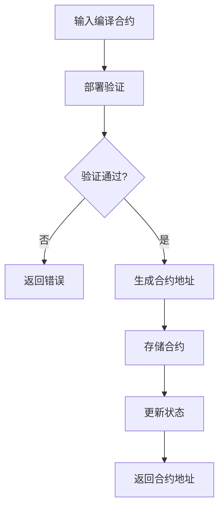
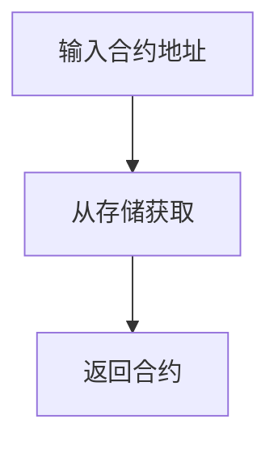
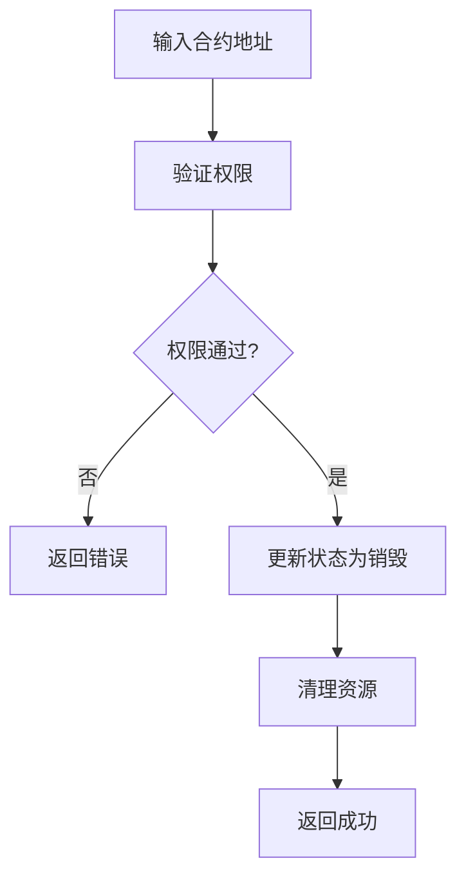
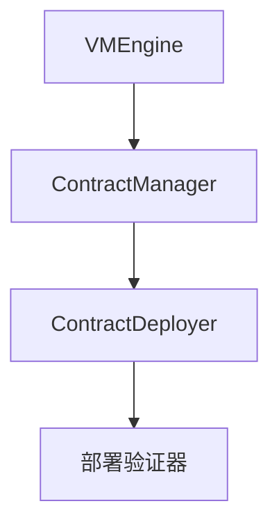

# 合约管理模块详细设计文档

## 1. 引言

### 1.1 编写目的
本文档详细描述合约管理模块的设计与实现，确保智能合约的生命周期得到有效管理。此版本基于模块化架构设计进行了更新。

### 1.2 术语定义
- ContractManager: 合约管理器
- ContractAddress: 合约地址
- CompiledContract: 编译后的合约
- ContractStatus: 合约状态

## 2. 概述

### 2.1 功能概述
合约管理模块负责智能合约的生命周期管理，包括：
- 合约部署
- 合约卸载
- 合约状态管理
- 合约查询
- 合约存储管理

### 2.2 架构图
``mermaid
graph TD
A[合约管理模块] --> B[合约部署器]
B --> C[部署验证器]
```

## 3. 详细设计

### 3.1 核心数据结构

#### 3.1.1 ContractManager 结构体
```go
type ContractManager struct {
    config ContractConfig
    deployer *ContractDeployer
}
```

#### 3.1.2 ContractConfig 配置结构
```go
type ContractConfig struct {
    // 最大合约数量
    MaxContracts uint64
    
    // 部署验证配置
    DeploymentValidation DeploymentValidationConfig
}
```

#### 3.1.3 ContractStatus 合约状态
```go
type ContractStatus int

const (
    ContractStatusUnknown ContractStatus = iota
    ContractStatusDeployed
    ContractStatusSuspended
    ContractStatusDestroyed
    ContractStatusUpgrading
)
```

### 3.2 核心接口设计

#### 3.2.1 ContractManager 接口
```go
// ContractManager 合约管理模块接口（与架构文档保持一致）
// 根据简化设计原则，接口已精简为核心功能
// 存储管理功能已整合到合约管理模块中
type ContractManager interface {
    // Deploy 部署合约
    Deploy(contract CompiledContract) (ContractAddress, error)
    
    // GetContract 获取合约
    GetContract(address ContractAddress) (CompiledContract, error)
    
    // GetContractABI 获取合约ABI
    GetContractABI(address ContractAddress) (ABI, error)
}
```

### 3.3 核心功能实现

#### 3.3.1 合约部署流程


#### 3.3.2 合约获取流程


#### 3.3.3 合约卸载流程


## 4. 模块设计

### 4.1 合约部署器模块

#### 4.1.1 功能描述
负责智能合约的部署过程，包括验证、地址生成和存储。

#### 4.1.2 接口设计
```go
type ContractDeployer interface {
    // Deploy 部署合约
    Deploy(contract CompiledContract) (ContractAddress, error)
    
    // ValidateDeployment 验证部署
    ValidateDeployment(contract CompiledContract) error
    
    // GenerateContractAddress 生成合约地址
    GenerateContractAddress(contract CompiledContract) ContractAddress
    
    // StoreContract 存储合约
    StoreContract(contract CompiledContract, address ContractAddress) error
}
```

#### 4.1.3 实现细节
1. 验证合约的完整性和安全性
2. 生成唯一的合约地址
3. 将合约存储到存储管理模块
4. 更新合约状态为已部署

合约部署成功后，会生成两个部分：
1. **可以被import的合约模块**：包含合约的源代码和ABI信息，供其他合约通过import语句引用和复用合约功能
2. **可以被调用的合约程序**：包含编译后的可执行二进制文件，供外部系统通过虚拟机引擎调用执行

## 5. 合约状态管理

### 5.1 状态转换图
``mermaid
graph TD
A[Unknown] --> B[Deployed]
B --> C[Suspended]
B --> D[Destroyed]
B --> E[Upgrading]
C --> B
D --> |不可逆| F[Final]
E --> B
```

### 5.2 状态管理接口
```go
type ContractStateManager interface {
    // GetStatus 获取合约状态
    GetStatus(address ContractAddress) (ContractStatus, error)
    
    // SetStatus 设置合约状态
    SetStatus(address ContractAddress, status ContractStatus) error
    
    // ValidateStatusTransition 验证状态转换
    ValidateStatusTransition(from, to ContractStatus) bool
    
    // GetStatusHistory 获取状态历史
    GetStatusHistory(address ContractAddress) []StatusTransition
}
```

### 5.3 状态转换记录
```go
type StatusTransition struct {
    FromStatus   ContractStatus
    ToStatus     ContractStatus
    Timestamp    time.Time
    Reason       string
    PerformedBy  string
}
```

## 6. 合约升级机制

### 6.1 升级流程
``mermaid
graph TD
A[请求合约升级] --> B[验证权限]
B --> C[验证新合约]
C --> D[设置状态为升级中]
D --> E[部署新合约]
E --> F[迁移数据]
F --> G[更新引用]
G --> H[设置状态为已部署]
```

### 6.2 升级接口
```go
type ContractUpgrader interface {
    // Upgrade 升级合约
    Upgrade(address ContractAddress, newContract CompiledContract) error
    
    // ValidateUpgrade 验证升级
    ValidateUpgrade(oldContract, newContract CompiledContract) error
    
    // MigrateData 迁移数据
    MigrateData(address ContractAddress) error
    
    // Rollback 回滚升级
    Rollback(address ContractAddress) error
}
```

## 7. 安全设计

### 7.1 部署验证
```go
type DeploymentValidator interface {
    // ValidateContract 验证合约
    ValidateContract(contract CompiledContract) error
    
    // CheckDeploymentLimits 检查部署限制
    CheckDeploymentLimits() error
    
    // VerifyContractIntegrity 验证合约完整性
    VerifyContractIntegrity(contract CompiledContract) error
}
```

### 7.2 权限控制
- 部署权限控制
- 升级权限控制
- 卸载权限控制
- 状态修改权限控制

### 7.3 数据保护
- 合约数据备份
- 升级回滚机制
- 数据一致性保证

## 8. 错误处理

### 8.1 错误分类
- 部署错误
- 状态错误
- 权限错误
- 系统错误

### 8.2 错误码设计
```go
const (
    // 部署相关错误
    ErrDeploymentFailed = 1001
    ErrInvalidContract = 1002
    ErrContractAlreadyExists = 1003
    
    // 状态相关错误
    ErrInvalidStatusTransition = 3001
    ErrContractSuspended = 3002
    ErrContractDestroyed = 3003
    
    // 权限相关错误
    ErrPermissionDenied = 4001
    ErrInvalidOwner = 4002
    
    // 升级相关错误
    ErrUpgradeFailed = 5001
    ErrIncompatibleUpgrade = 5002
    
    // 系统相关错误
    ErrSystemError = 6001
)
```

### 8.3 错误信息结构
```go
type ContractError struct {
    Code     int
    Message  string
    Address  ContractAddress
    Status   ContractStatus
    Details  string
    Err      error
}
```

## 9. 测试设计

### 9.1 单元测试
为每个合约管理模块编写单元测试，确保功能正确性。

### 9.2 集成测试
编写集成测试，验证整个合约管理流程的正确性。

### 9.3 性能测试
编写性能测试，验证合约管理的性能指标。

### 9.4 安全测试
编写安全测试，验证合约管理的安全性。

## 10. 部署与运维

### 10.1 配置管理
```yaml
contract:
  max_contracts: 1000000
  deployment_validation:
    enable_signature_check: true
    enable_gas_limit_check: true
    max_contract_size: 1048576 # 1MB
```

### 10.2 监控指标
- 合约部署成功率
- 合约状态分布
- 升级成功率

### 10.3 性能调优
```go
type ContractManagerStats struct {
    TotalDeployed uint64
    TotalLoaded   uint64
    ErrorCount    uint64
}
```

## 11. 与其他模块的交互

### 11.1 与虚拟机引擎的交互
```go
// VMEngineConfig 虚拟机引擎配置
type VMEngineConfig struct {
    ContractManager    ContractManager  // 合约管理模块
    // 其他模块...
}
```

### 11.2 数据传输对象
```go
// 合约部署请求
type DeployContractRequest struct {
    Contract CompiledContract
    Deployer string
    Options  DeployOptions
}

// 合约部署响应
type DeployContractResponse struct {
    Address ContractAddress
    Success bool
    Error   error
}
```

## 12. 附录

### 12.1 合约信息结构
```go
type ContractInfo struct {
    // 合约地址
    Address ContractAddress
    
    // 合约状态
    Status ContractStatus
    
    // 部署时间
    DeployedAt time.Time
    
    // 最后更新时间
    UpdatedAt time.Time
    
    // 合约大小
    Size uint64
    
    // Gas价格
    GasPrice uint64
    
    // 部署者
    DeployedBy string
    
    // 合约版本
    Version string
}
```

### 12.2 部署验证配置
```go
type DeploymentValidationConfig struct {
    // 是否启用签名检查
    EnableSignatureCheck bool
    
    // 是否启用Gas限制检查
    EnableGasLimitCheck bool
    
    // 最大合约大小
    MaxContractSize uint64
    
    // 允许的合约类型
    AllowedContractTypes []string
}
```

### 12.3 接口依赖关系
