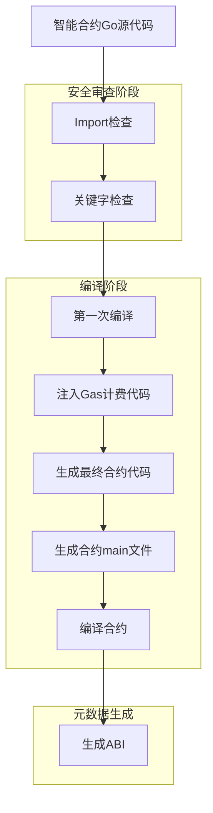

# 智能合约处理流程

## 1. 概述

本文档详细描述了智能合约从源代码到可执行二进制文件的完整处理流程，包括import检查、关键字检查、编译、Gas计费代码注入、文件放置和ABI生成等步骤。

## 2. 处理流程图

## 3. 详细步骤说明

### 3.1 Import检查
在合约处理的第一步，系统会对源代码进行静态分析，检查所有import语句：

- **白名单机制**：只允许导入指定的安全库
  - `fmt`: 格式化输入输出
  - `strconv`: 字符串转换
  - `math`: 数学计算
  - `time`: 时间处理
  - `errors`: 错误处理
  - `github.com/lengzhao/vm`: 项目默认库

- **审查流程**：
  1. 解析源代码为AST（抽象语法树）
  2. 遍历AST节点，提取所有import声明
  3. 对比白名单，检查是否有禁止的导入
  4. 如果发现违规导入，拒绝合约处理并返回错误

### 3.2 关键字检查
在通过import检查后，系统会进一步检查源代码中的关键字使用：

- **关键字分类**：
  - **禁止关键字**：`unsafe`, `go`, `select`, `chan`, `goto`, `map`, `cap`
  - **允许关键字**：基本类型、控制流、包管理等安全关键字
  - **限制关键字**：需要在特定上下文中使用的关键词

- **审查流程**：
  1. 遍历AST节点，识别所有关键字使用
  2. 检查关键字是否在禁止列表中
  3. 对限制关键字检查使用上下文是否安全
  4. 如果发现违规使用，拒绝合约处理并返回详细错误信息

### 3.3 第一次编译
通过安全审查后，系统会首先进行一次编译以确保合约能够正常编译：

- **编译工具**：使用TinyGo编译器
- **编译目的**：验证语法正确性和基本可编译性
- **编译流程**：
  1. 生成临时源代码文件
  2. 调用TinyGo编译器进行编译
  3. 检查编译结果，处理编译错误
  4. 确认源代码可以成功编译

### 3.4 注入Gas计费代码
为了防止合约执行消耗过多系统资源，系统会在编译后的代码中注入Gas计费逻辑：

- **计费模型**：
  1. **代码行计费**：每行代码执行消耗1点gas
  2. **接口操作计费**：包函数调用有固定gas消耗
  3. **复杂计算计费**：在default library中显式指定更多gas消耗

- **注入流程**：
  1. 分析AST，识别代码块和函数调用
  2. 在适当位置插入Gas消耗代码
  3. 确保Gas计量不会影响合约逻辑正确性

### 3.5 生成最终合约代码
Gas注入完成后，系统会生成最终的合约代码并放置到专属文件夹中：

- **代码生成**：
  - 将注入Gas计费代码后的源码保存到指定位置
  - 每个合约有独立的文件夹存储其源代码
  - 确保代码版本控制和隔离

- **路径管理**：
  - 每个智能合约的源码单独存储在以合约hash命名的文件夹中
  - 合约存储目录由[VMConfig.ContractStorageDir](../../engine.go#L20-L20)配置
  - 文件命名规则：`contract_<hash>`
  - 确保每个合约有唯一的标识符，相同的源码总是映射到相同的文件夹

### 3.6 生成合约main文件
为了使Go源代码能够独立执行，系统会生成对应的main函数：

- **Main函数生成**：
  1. 分析合约中的公开函数
  2. 生成main函数，提供函数调用入口
  3. 实现参数解析和结果返回机制

### 3.7 编译合约
将处理后的源代码编译成可执行的二进制文件：

- **编译工具**：使用TinyGo编译器优化生成的二进制文件大小
- **编译流程**：
  1. 使用处理后的源代码（包含Gas计费代码和main函数）
  2. 调用TinyGo编译器进行编译
  3. 生成可执行二进制文件
  4. 确保二进制文件在沙箱环境中可执行

### 3.8 生成ABI
最后，系统会为合约生成ABI（Application Binary Interface）：

- **ABI内容**：
  - 合约中可调用的函数列表
  - 每个函数的参数类型和返回值类型
  - 事件定义和日志结构
  - 合约的元数据信息

- **生成流程**：
  1. 扫描合约源代码，识别公开函数
  2. 提取函数签名和参数信息
  3. 序列化为JSON格式
  4. 存储ABI供外部系统使用

## 4. 错误处理

在整个处理流程中，任何步骤出现错误都会导致合约处理失败：

- **错误分类**：
  - 安全审查错误（import违规、关键字违规）
  - 编译错误（语法错误、类型错误）
  - 系统错误（文件操作失败、资源不足）

- **错误处理策略**：
  - 提供详细的错误信息和位置
  - 记录错误日志供调试使用
  - 确保系统状态一致性

## 5. 性能优化

- **缓存机制**：对已处理的合约进行缓存，避免重复处理
- **并行处理**：支持多个合约同时处理
- **增量处理**：只对修改的部分进行重新处理

## 6. 安全考虑

- **多层审查**：通过import检查和关键字检查确保合约安全性
- **沙箱执行**：在受限环境中执行合约
- **资源限制**：通过Gas机制防止资源滥用