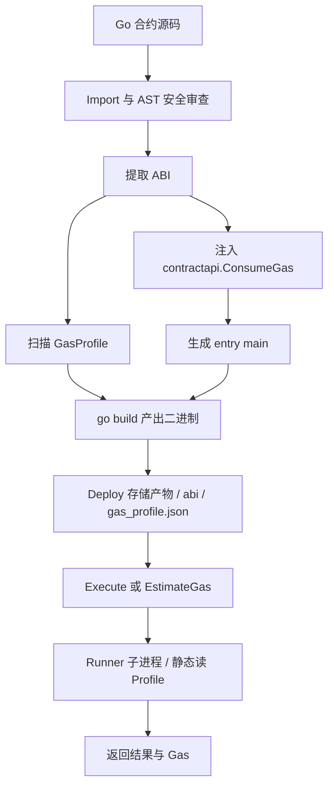

# 智能合约处理流程

## 1. 概述

本文档描述合约从源码到可执行产物，再被调用执行的完整流程。当前实现默认使用 `go build`；TinyGo 作为后续可选构建器。

## 2. 处理流程图


```mermaid
flowchart TD
    A[Go 合约源码] --> B[Import 与 AST 安全审查]
    B --> C[提取 ABI]
    C --> D[扫描 GasProfile]
    C --> E[注入 contractapi.ConsumeGas]
    E --> F[生成 entry main]
    D --> G[go build 产出二进制]
    F --> G
    G --> H[Deploy 存储产物 / abi / gas_profile.json]
    H --> I[Execute 或 EstimateGas]
    I --> J[Runner 子进程 / 静态读 Profile]
    J --> K[返回结果与 Gas]
```

## 3. 详细步骤

### 3.1 安全审查
1. Import 白名单检查
2. 拒绝危险 AST 节点：`go` / `select` / `chan` / `map` / `goto` / `cap` / `unsafe`
3. 拒绝包级可变全局变量
4. 合约源码不得包含 `main`

### 3.2 ABI 生成
基于原始源码提取导出函数签名与事件信息。

### 3.3 Gas 注入与 Profile（已实现）
- 在函数入口和 `for` / `range` 循环体插入 `contractapi.ConsumeGas(1)`
- 对原始源码扫描生成 `GasProfile`（函数入口数、循环点数、contractapi 调用）
- 只读上下文与 `Log` 在 `contractapi` 内按表扣费；Object / Call Gas 后置

### 3.4 入口生成
编译器生成独立 `entry.go`：
- `contractapi.InitGas` + 入口基础 Gas(10)
- 解析 stdin JSON 请求
- 按函数名分发调用
- 输出 JSON 结果和 `gas`（`GasUsed()`）
- 读取 `VM_GAS_LIMIT`

### 3.5 构建与缓存
1. 源码指纹含 `compilerBuildID`；若 `contract_<hash>` 已存在则跳过构建
2. 临时构建目录写入：
   - `contract.go`（Gas 注入后源码，包名规范为 `main`）
   - `entry.go`
   - `contractapi/`（由 `//go:embed` 展开的合约侧 SDK + 本地 `go.mod`）
   - `go.mod`（`replace github.com/lengzhao/vm/contractapi => ./contractapi`）
3. 执行 `go build -mod=mod -o <exec>`（无需每次 `go mod tidy`）

### 3.6 部署存储
`ContractManager` 将可执行文件、`abi.json`、`metadata.json`、`gas_profile.json` 存入：

```text
contracts/{address}/
  ├── contract_<hash>
  ├── abi.json
  ├── metadata.json
  └── gas_profile.json
```

### 3.7 执行与估算
1. `VMEngine.Execute` / `ExecuteWithContext` 加载合约
2. `ProcessRunner` 以超时上下文启动二进制，注入最小 `VM_*` 环境
3. stdin 写入 `{"function":"...","args":[...]}`
4. 解析 stdout JSON（含 `events`），回写宿主 `GasMetering`；结果以 `ExecuteResult` 为准
5. `EstimateGas`：默认读 `gas_profile.json` 静态保守上界；`DryRun` 真执行取 `GasConsumed`

## 4. 错误处理
任一阶段失败即中止：
- 安全审查失败
- 构建失败
- 部署缺产物
- 执行超时 / Gas 超限 / 未知函数
- 静态 `EstimateGas` 缺少 `gas_profile.json`（旧合约需重部署）

## 5. 当前限制
- 参数类型支持：`int` / `int64` / `uint64` / `float64` / `string` / `bool`
- Object / 跨合约 Call 后置
- 复杂沙箱后置
