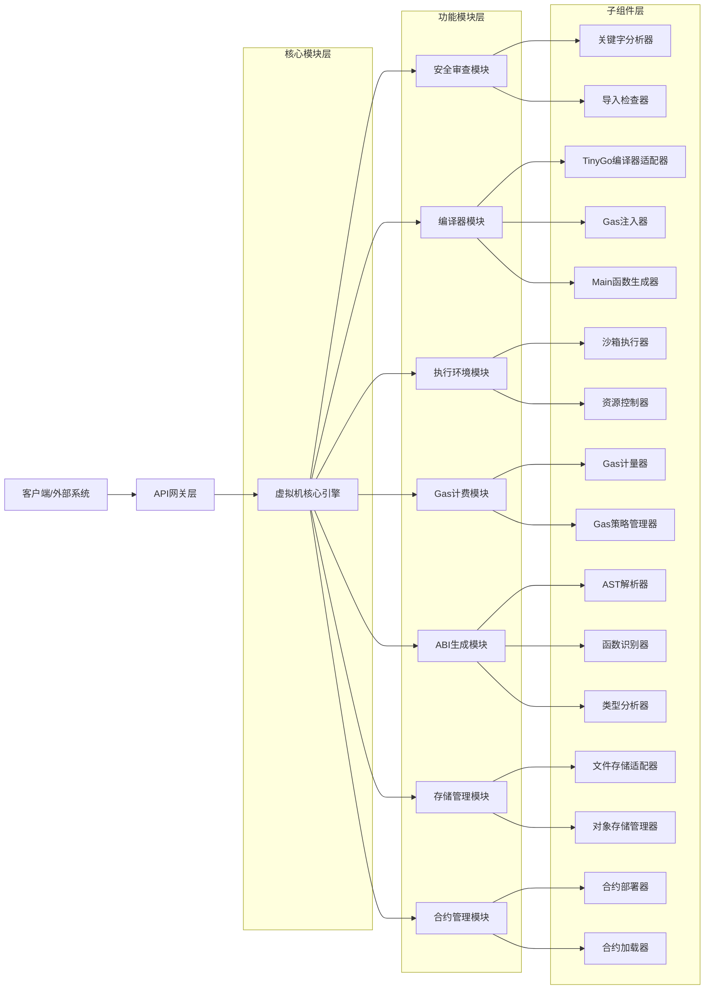

# 智能合约虚拟机详细设计总览（更新版）

## 1. 引言

### 1.1 编写目的
本文档旨在详细描述智能合约虚拟机的模块化架构设计实现细节，为开发人员提供完整的技术参考，确保系统实现的一致性和可维护性。此版本基于最新的模块化架构设计进行了全面更新。

### 1.2 项目概述
本项目是一个基于 Golang 的智能合约虚拟机，允许开发者直接使用原生 Golang 代码编写智能合约。通过模块化设计、关键字限制和导入控制确保执行安全性，同时提供与区块链环境交互的默认库接口。

### 1.3 读者对象
- 系统架构师
- 软件开发工程师
- 测试工程师
- 技术文档编写人员

## 2. 系统架构详细设计

### 2.1 总体架构图


### 2.2 核心组件详细设计

#### 2.2.1 虚拟机核心引擎
虚拟机核心引擎是整个系统的协调者，负责协调各功能模块的工作。

##### 2.2.1.1 功能描述
- 协调各功能模块的工作
- 提供统一的外部接口
- 管理模块间的依赖关系
- 提供与外部系统交互的接口

##### 2.2.1.2 接口设计
```go
type VMEngine interface {
    // Compile 编译合约源代码
    Compile(sourceCode string) (CompiledContract, error)
    
    // Deploy 部署合约
    Deploy(contract CompiledContract) (ContractAddress, error)
    
    // Execute 执行合约函数
    Execute(address ContractAddress, function string, args ...interface{}) ([]byte, error)
    
    // Call 跨合约调用
    Call(contract Address, function string, args ...any) ([]byte, error)
    
    // Stop 停止虚拟机
    Stop() error
    
    // GetContractABI 获取合约ABI
    GetContractABI(address ContractAddress) (ABI, error)
    
    // GetContractStatus 获取合约状态
    GetContractStatus(address ContractAddress) (ContractStatus, error)
    
    // GetVersion 获取虚拟机版本
    GetVersion() string
}
```

#### 2.2.2 安全审查模块
安全审查模块在合约执行前进行静态分析，确保合约代码的安全性。

##### 2.2.2.1 功能描述
- 在合约执行前进行静态分析
- 审查并禁止使用危险关键字
- 检查导入列表，仅允许导入指定的安全库

##### 2.2.2.2 接口设计
```go
type SecurityReviewer interface {
    // Review 对合约源代码进行安全审查
    Review(sourceCode string) (*ReviewResult, error)
    
    // IsKeywordAllowed 检查关键字是否被允许
    IsKeywordAllowed(keyword string) bool
    
    // IsImportAllowed 检查导入是否被允许
    IsImportAllowed(importPath string) bool
    
    // AddForbiddenKeyword 添加禁止关键字
    AddForbiddenKeyword(keyword string)
    
    // AddAllowedImport 添加允许导入
    AddAllowedImport(importPath string)
}
```

#### 2.2.3 编译器模块
编译器模块负责将Golang源代码编译为可执行的二进制文件。

##### 2.2.3.1 功能描述
- 使用TinyGo编译器编译源代码
- 注入Gas计费代码
- 生成Main函数
- 生成可执行文件

##### 2.2.3.2 接口设计
```go
type ContractCompiler interface {
    // Compile 编译源代码
    Compile(sourceCode string) (*CompilationResult, error)
    
    // Validate 验证源代码
    Validate(sourceCode string) error
    
    // InjectGasMetering 注入Gas计费代码
    InjectGasMetering(sourceCode string) (string, error)
    
    // GenerateMainFunction 生成Main函数
    GenerateMainFunction(sourceCode string) (string, error)
}
```

#### 2.2.4 执行环境模块
执行环境模块提供严格受限的运行环境，防止合约访问宿主系统的敏感资源。

##### 2.2.4.1 功能描述
- 提供严格受限的运行环境
- 防止合约访问宿主系统的文件、网络或其他敏感资源
- 确保合约执行的安全性和隔离性

##### 2.2.4.2 接口设计
```go
type ExecutionEnvironment interface {
    // Run 在执行环境中运行合约
    Run(contract CompiledContract, function string, args ...interface{}) (*ExecutionResult, error)
    
    // SetResourceLimit 设置资源限制
    SetResourceLimit(limit ResourceLimit)
    
    // GetResourceUsage 获取资源使用情况
    GetResourceUsage() ResourceUsage
    
    // Stop 停止执行环境
    Stop() error
}
```

#### 2.2.5 Gas计费模块
Gas计费模块通过计费机制防止合约执行消耗过多系统资源。

##### 2.2.5.1 功能描述
- 跟踪和控制Gas消耗
- 实施Gas限制检查
- 管理Gas计费策略
- 记录Gas消耗历史

##### 2.2.5.2 接口设计
```go
type GasMetering interface {
    // ConsumeGas 消耗Gas
    ConsumeGas(amount uint64, description string) error
    
    // RefundGas 退还Gas
    RefundGas(amount uint64, description string)
    
    // GetConsumedGas 获取已消耗的Gas
    GetConsumedGas() uint64
    
    // GetRemainingGas 获取剩余Gas
    GetRemainingGas() uint64
    
    // SetGasLimit 设置Gas限制
    SetGasLimit(limit uint64)
    
    // Enable 启用Gas计量
    Enable()
    
    // Disable 禁用Gas计量
    Disable()
}
```

#### 2.2.6 ABI生成模块
ABI生成模块在合约编译阶段自动生成ABI（Application Binary Interface）。

##### 2.2.6.1 功能描述
- 从合约源代码生成接口信息
- 提取函数签名和参数信息
- 序列化为JSON格式
- 提供ABI验证功能

##### 2.2.6.2 接口设计
```go
type ABIGenerator interface {
    // Generate 从源代码生成ABI
    Generate(sourceCode string) (*ABI, error)
    
    // GenerateFromAST 从AST生成ABI
    GenerateFromAST(file *ast.File) (*ABI, error)
    
    // Validate 验证ABI的正确性
    Validate(abi *ABI) error
    
    // Serialize 序列化ABI
    Serialize(abi *ABI) ([]byte, error)
}
```

#### 2.2.7 存储管理模块
存储管理模块负责合约和相关数据的存储管理。

##### 2.2.7.1 功能描述
- 管理合约可执行文件的存储
- 管理合约ABI的存储
- 管理智能合约对象的存储
- 提供存储访问控制

##### 2.2.7.2 接口设计
```go
type StorageManager interface {
    // StoreContract 存储合约
    StoreContract(contract CompiledContract) (ContractAddress, error)
    
    // LoadContract 加载合约
    LoadContract(address ContractAddress) (CompiledContract, error)
    
    // DeleteContract 删除合约
    DeleteContract(address ContractAddress) error
    
    // StoreABI 存储ABI
    StoreABI(address ContractAddress, abi ABI) error
    
    // LoadABI 加载ABI
    LoadABI(address ContractAddress) (ABI, error)
    
    // GetContractPath 获取合约存储路径
    GetContractPath(address ContractAddress) string
}
```

#### 2.2.8 合约管理模块
合约管理模块负责合约的生命周期管理。

##### 2.2.8.1 功能描述
- 管理合约的部署和卸载
- 跟踪合约状态
- 提供合约查询功能
- 支持合约升级机制

##### 2.2.8.2 接口设计
```go
type ContractManager interface {
    // Deploy 部署合约
    Deploy(contract CompiledContract) (ContractAddress, error)
    
    // Undeploy 卸载合约
    Undeploy(address ContractAddress) error
    
    // GetContract 获取合约
    GetContract(address ContractAddress) (CompiledContract, error)
    
    // ListContracts 列出所有合约
    ListContracts() ([]ContractAddress, error)
    
    // GetContractStatus 获取合约状态
    GetContractStatus(address ContractAddress) (ContractStatus, error)
}
```

## 3. 模块间接口设计

### 3.1 依赖关系管理
通过依赖注入的方式管理模块间的依赖关系，降低耦合度：

```go
// VMEngineConfig 虚拟机引擎配置
type VMEngineConfig struct {
    SecurityReviewer   SecurityReviewer
    ContractCompiler   ContractCompiler
    ExecutionEnv       ExecutionEnvironment
    GasMetering        GasMetering
    ABIGenerator       ABIGenerator
    StorageManager     StorageManager
    ContractManager    ContractManager
    // 其他配置项
}

// NewVMEngine 创建新的虚拟机引擎实例
func NewVMEngine(config VMEngineConfig) VMEngine {
    return &vmEngineImpl{
        securityReviewer: config.SecurityReviewer,
        compiler:         config.ContractCompiler,
        executionEnv:     config.ExecutionEnv,
        gasMetering:      config.GasMetering,
        abiGenerator:     config.ABIGenerator,
        storageManager:   config.StorageManager,
        contractManager:  config.ContractManager,
    }
}
```

### 3.2 数据传输对象
定义清晰的数据传输对象，确保模块间数据传递的一致性：

```go
// CompiledContract 编译后的合约
type CompiledContract struct {
    // 合约可执行文件路径
    ExecutablePath string
    
    // ABI信息
    ABI ABI
    
    // 编译时间
    CompileTime time.Time
    
    // Gas价格
    GasPrice uint64
    
    // 源代码哈希
    SourceHash string
    
    // 合约地址
    Address ContractAddress
}

// CompilationResult 编译结果
type CompilationResult struct {
    // 编译后的合约
    Contract CompiledContract
    
    // 编译日志
    Logs []string
    
    // 编译是否成功
    Success bool
    
    // 错误信息
    Error error
}

// ReviewResult 审查结果
type ReviewResult struct {
    // 审查是否通过
    Passed bool
    
    // 错误信息列表
    Errors []ReviewError
    
    // 警告信息列表
    Warnings []ReviewWarning
    
    // 审查时间
    ReviewTime time.Time
}

// ExecutionResult 执行结果
type ExecutionResult struct {
    // 执行结果数据
    Data []byte
    
    // Gas消耗
    GasConsumed uint64
    
    // 执行时间
    ExecutionTime time.Duration
    
    // 是否成功
    Success bool
    
    // 错误信息
    Error error
}
```

## 4. 扩展性设计

### 4.1 插件化架构
通过接口定义实现插件化架构，支持功能模块的动态替换和扩展：

```go
// Plugin 插件接口
type Plugin interface {
    // Name 插件名称
    Name() string
    
    // Version 插件版本
    Version() string
    
    // Initialize 初始化插件
    Initialize(config map[string]interface{}) error
    
    // Shutdown 关闭插件
    Shutdown() error
}

// PluginManager 插件管理器
type PluginManager interface {
    // RegisterPlugin 注册插件
    RegisterPlugin(plugin Plugin) error
    
    // UnregisterPlugin 注销插件
    UnregisterPlugin(name string) error
    
    // GetPlugin 获取插件
    GetPlugin(name string) (Plugin, error)
    
    // ListPlugins 列出所有插件
    ListPlugins() []string
}
```

### 4.2 配置管理
通过统一的配置管理机制支持模块的灵活配置：

```go
// Config 配置接口
type Config interface {
    // Get 获取配置项
    Get(key string) (interface{}, error)
    
    // Set 设置配置项
    Set(key string, value interface{}) error
    
    // LoadFromFile 从文件加载配置
    LoadFromFile(path string) error
    
    // SaveToFile 保存配置到文件
    SaveToFile(path string) error
}

// ConfigManager 配置管理器
type ConfigManager struct {
    configs map[string]Config
}

// GetConfig 获取配置
func (cm *ConfigManager) GetConfig(module string) Config {
    return cm.configs[module]
}
```

## 5. 测试支持设计

### 5.1 模块化测试
每个模块提供专门的测试接口，支持独立测试：

```go
// Testable 可测试接口
type Testable interface {
    // SetupTest 测试设置
    SetupTest() error
    
    // TeardownTest 测试清理
    TeardownTest() error
    
    // RunTest 运行测试
    RunTest(testName string, testData interface{}) (interface{}, error)
}

// ModuleTester 模块测试器
type ModuleTester struct {
    module Testable
}

// RunModuleTest 运行模块测试
func (mt *ModuleTester) RunModuleTest(testName string, testData interface{}) (interface{}, error) {
    if err := mt.module.SetupTest(); err != nil {
        return nil, err
    }
    defer mt.module.TeardownTest()
    
    return mt.module.RunTest(testName, testData)
}
```

## 6. 数据结构设计

### 6.1 核心数据结构

#### 6.1.1 合约地址
```go
type ContractAddress string
```

#### 6.1.2 编译后的合约
```go
type CompiledContract struct {
    Bytecode []byte
    ABI      ABI
}
```

#### 6.1.3 ABI结构
```go
type ABI struct {
    Functions []Function
    Events    []Event
}
```

#### 6.1.4 函数定义
```go
type Function struct {
    Name       string
    Inputs     []Parameter
    Outputs    []Parameter
    GasCost    uint64
}
```

#### 6.1.5 资源限制
```go
type ResourceLimit struct {
    MaxMemory    uint64 // 最大内存使用量 (bytes)
    MaxCPU       uint64 // 最大CPU时间 (milliseconds)
    MaxStorage   uint64 // 最大存储空间 (bytes)
    MaxNetwork   uint64 // 最大网络流量 (bytes)
}
```

#### 6.1.6 资源使用情况
```go
type ResourceUsage struct {
    MemoryUsage  uint64
    CPUUsage     uint64
    StorageUsage uint64
    NetworkUsage uint64
}
```

## 7. 接口设计

### 7.1 外部接口
虚拟机对外提供以下接口供其他系统调用：

#### 7.1.1 合约管理接口
- Compile(sourceCode string) (CompiledContract, error)
- Deploy(contract CompiledContract) (ContractAddress, error)
- Execute(address ContractAddress, function string, args ...interface{}) ([]byte, error)
- Call(contract Address, function string, args ...any) ([]byte, error)

#### 7.1.2 查询接口
- GetContractABI(address ContractAddress) (ABI, error)
- GetContractStatus(address ContractAddress) (ContractStatus, error)
- GetVersion() string

## 8. 安全设计

### 8.1 关键字白名单机制
采用白名单机制定义允许的关键字，确保不同Golang版本的兼容性。

### 8.2 导入白名单机制
合约只能导入指定的安全库，采用白名单机制。

### 8.3 默认函数白名单机制
只允许使用白名单中定义的默认函数，确保合约的安全性和兼容性。

### 8.4 沙箱隔离机制
通过沙箱机制限制合约对系统资源的访问，确保执行环境的安全性。

### 8.5 Gas计费机制
通过Gas计费系统防止合约执行消耗过多系统资源。

## 9. 性能设计

### 9.1 编译优化
使用TinyGo编译器优化生成的二进制文件大小。

### 9.2 执行缓存
对已编译的合约进行缓存，避免重复编译。

### 9.3 并行执行支持
通过对象隔离机制支持交易的并行执行。

### 9.4 模块缓存
各功能模块实现内部缓存机制，提高性能。

## 10. 部署设计

### 10.1 部署架构
本项目设计为一个开源库，方便其他区块链项目集成智能合约功能。

### 10.2 集成方式
其他区块链项目可以通过Go模块导入本项目，使用项目提供的API来编译、部署和执行智能合约。

### 10.3 部署要求
- Go 1.16+
- TinyGo 0.20+
- Linux/Unix 环境

## 11. 测试设计

### 11.1 单元测试
为每个模块编写单元测试，确保功能正确性。

### 11.2 集成测试
编写集成测试，验证各模块间的协作。

### 11.3 性能测试
编写性能测试，验证系统的性能指标。

### 11.4 安全测试
编写安全测试，验证系统的安全性。

## 12. 运维设计

### 12.1 监控指标
定义关键监控指标，包括：
- 合约执行成功率
- 平均执行时间
- Gas消耗情况
- 资源使用情况
- 各模块性能指标

### 12.2 日志设计
定义统一的日志格式，便于问题排查和系统监控。

### 12.3 错误处理
建立完善的错误处理机制，确保系统稳定性。

## 13. 实施建议

### 13.1 分阶段实施
1. **第一阶段**：重构核心引擎，明确各模块接口
2. **第二阶段**：实现模块解耦，引入依赖注入
3. **第三阶段**：完善配置管理和插件机制
4. **第四阶段**：增强测试支持和监控能力

### 13.2 技术选型建议
1. 使用依赖注入框架（如 Wire）管理模块依赖
2. 采用配置文件（如 YAML）管理模块配置
3. 实现统一的日志和监控接口
4. 建立完善的单元测试和集成测试体系

### 13.3 质量保障措施
1. 建立代码审查机制，确保接口设计符合规范
2. 实施持续集成，自动化测试和部署
3. 建立性能基准测试，监控系统性能变化
4. 定期进行架构评审，持续优化系统设计

## 14. 附录

### 14.1 术语表
- ABI: Application Binary Interface，应用程序二进制接口
- AST: Abstract Syntax Tree，抽象语法树
- Gas: 虚拟机中用于衡量计算复杂度和资源消耗的单位
- VM: Virtual Machine，虚拟机

### 14.2 详细设计文档列表
1. [虚拟机执行引擎详细设计](updated_vm_engine_detailed_design.md)
2. [安全审查系统详细设计](updated_security_review_detailed_design.md)
3. [编译器模块详细设计](updated_compiler_detailed_design.md)
4. [执行环境模块详细设计](updated_execution_environment_detailed_design.md)
5. [Gas计费系统详细设计](updated_gas_metering_detailed_design.md)
6. [ABI生成器详细设计](updated_abi_generator_detailed_design.md)
7. [存储管理模块详细设计](updated_storage_manager_detailed_design.md)
8. [合约管理模块详细设计](updated_contract_manager_detailed_design.md)

### 14.3 参考文献
- [架构设计文档](../architecture.md)
- [安全审查规范](../security_review.md)
- [默认库接口规范](../default_library.md)
- [执行环境设计](../execution_environment.md)
- [Gas计费机制](../gas_metering.md)
- [ABI生成与关键字处理](../abi_generation.md)