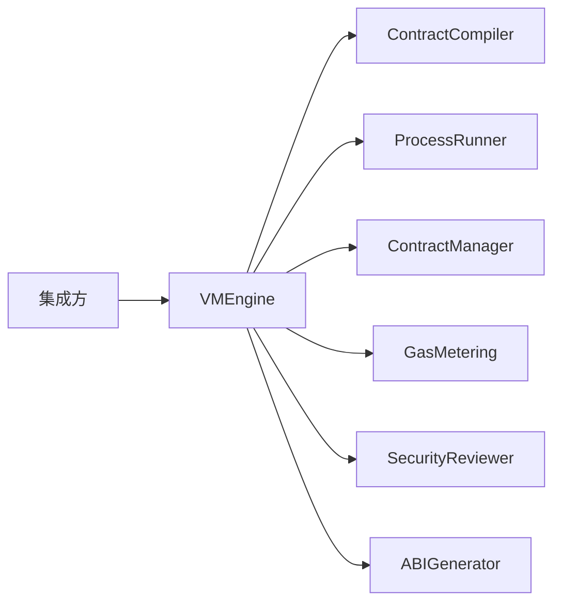

# 智能合约虚拟机详细设计总览

## 1. 引言

本文档是详细设计入口。**当前真相源**以流水线文档为准：

- [`../architecture.md`](../architecture.md)
- [`contract_processing_flow.md`](contract_processing_flow.md)
- [`vm_engine_detailed_design.md`](vm_engine_detailed_design.md)
- [`../execution_environment.md`](../execution_environment.md)

## 2. MVP 已实现

```mermaid
flowchart LR
    Client[集成方] --> Engine[VMEngine]
    Engine --> Compiler[ContractCompiler]
    Engine --> Runner[ProcessRunner]
    Engine --> Store[ContractManager]
    Engine --> Gas[GasMetering]
    Engine --> Security[SecurityReviewer]
    Engine --> ABIGen[ABIGenerator]
```

| 模块 | MVP 能力 |
|------|----------|
| SecurityReviewer | Import 白名单、危险 AST、禁包级 var、禁合约 `main` |
| ContractCompiler | Gas 注入、entry 生成、`go build` |
| Runner | 进程超时 + JSON I/O + `VM_GAS_LIMIT` |
| ContractManager | 目录存储二进制 / abi.json / metadata.json |
| GasMetering | 宿主计数 + 子进程控制点消耗 |
| ABI | 导出函数与事件提取 |

## 3. 后置能力

以下内容保留设计方向，**当前未实现**：

- Host Runtime / 默认库（链上下文、Object、跨合约）
- EstimateGas 与默认库接口定价
- Docker / seccomp / WASM 沙箱
- TinyGo 默认构建
- LevelDB / 外部对象存储
- 合约升级、并行调度、API 网关、插件机制

详见：

- [`../default_library.md`](../default_library.md) 与 [`host_runtime.md`](../host_runtime.md)
- [`../gas_metering.md`](../gas_metering.md)
- [`sandbox_roadmap.md`](../sandbox_roadmap.md)

## 4. 模块详细设计索引

| 文档 | 状态 |
|------|------|
| [vm_engine_detailed_design.md](vm_engine_detailed_design.md) | 已对齐 MVP |
| [contract_processing_flow.md](contract_processing_flow.md) | 已对齐 MVP |
| [compiler_detailed_design.md](compiler_detailed_design.md) | 已对齐 MVP（`go build`） |
| [execution_environment_detailed_design.md](execution_environment_detailed_design.md) | 已对齐 MVP（Runner） |
| [contract_manager_detailed_design.md](contract_manager_detailed_design.md) | 已对齐 MVP（文件存储） |
| [gas_metering_detailed_design.md](gas_metering_detailed_design.md) | 已对齐 MVP + 下一阶段 |
| [security_review_detailed_design.md](security_review_detailed_design.md) | 参考顶层规范 |
| [abi_generator_detailed_design.md](abi_generator_detailed_design.md) | 参考顶层规范 |

## 5. 测试基线

- `go test ./...`
- Runner：成功 / 未知函数 / 超时 / Gas 超限 / 非法响应
- Engine E2E：Compile→Deploy→Execute，以及失败路径
- ContractManager：真实二进制 Deploy 后再 Execute

## 6. 演进原则

1. 先保证可验证主链路，再扩展 Host / Gas / 沙箱
2. 文档与代码同步，旧目标态必须标注后置
3. 不引入 `internal`；按需拆普通包（如未来 `contractapi`）
