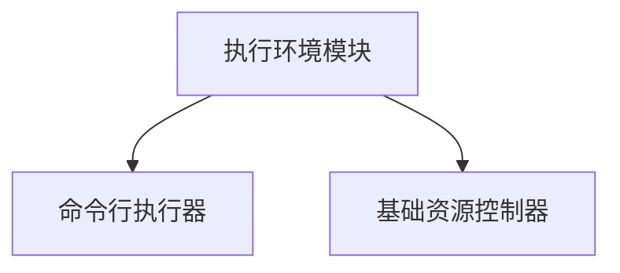
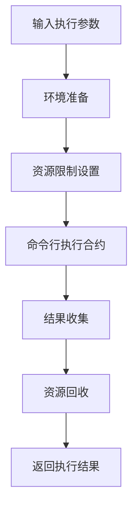
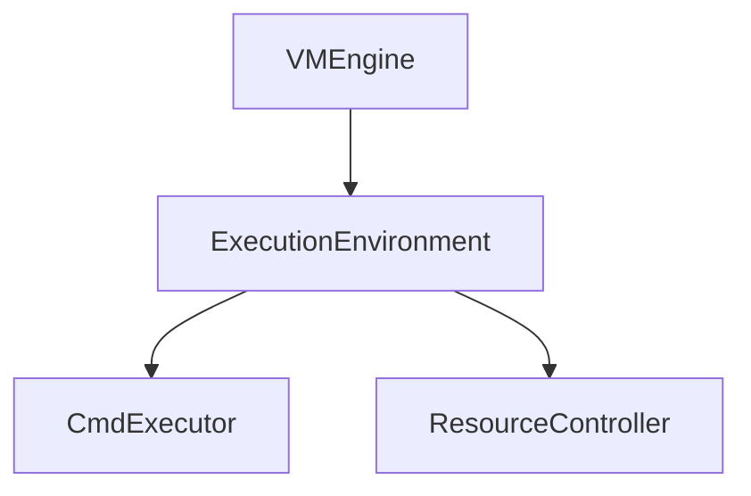

# 执行环境模块详细设计文档

## 1. 引言

### 1.1 编写目的
本文档详细描述执行环境模块的设计与实现，确保智能合约在受限环境中安全执行。此版本基于模块化架构设计进行了更新。

### 1.2 术语定义
- ExecutionEnvironment: 执行环境
- Sandbox: 沙箱环境
- Resource Control: 资源控制
- Isolation: 隔离

## 2. 概述

### 2.1 功能概述
执行环境模块提供合约执行环境，包括：
- 简化的执行接口
- 基础资源控制
- 执行监控

根据当前需求，执行器暂时不需要复杂实现，只需要有对应的接口，用cmd调用合约就行。

### 2.2 架构图


## 3. 详细设计

### 3.1 核心数据结构

#### 3.1.1 ExecutionEnvironment 结构体
```go
type ExecutionEnvironment struct {
    config ExecutionConfig
    cmdExecutor *CmdExecutor
    resourceController *ResourceController
}
```

#### 3.1.2 ExecutionConfig 配置结构
```go
type ExecutionConfig struct {
    // 资源限制
    ResourceLimit ResourceLimit
    
    // 执行超时
    ExecutionTimeout time.Duration
    
    // 工作目录
    WorkingDir string
    
    // 环境变量
    EnvironmentVariables map[string]string
}
```

#### 3.1.3 ExecutionResult 执行结果
```go
type ExecutionResult struct {
    // 执行结果数据
    Data []byte
    
    // Gas消耗
    GasConsumed uint64
    
    // 执行时间
    ExecutionTime time.Duration
    
    // 是否成功
    Success bool
    
    // 错误信息
    Error error
    
    // 资源使用情况
    ResourceUsage ResourceUsage
}
```

### 3.2 核心接口设计

#### 3.2.1 ExecutionEnvironment 接口
```go
// ExecutionEnvironment 执行环境模块接口（与架构文档保持一致）
type ExecutionEnvironment interface {
    // Run 在执行环境中运行合约
    Run(contract CompiledContract, function string, args ...interface{}) (*ExecutionResult, error)
    
    // SetResourceLimit 设置资源限制
    SetResourceLimit(limit ResourceLimit)
    
    // GetResourceUsage 获取资源使用情况
    GetResourceUsage() ResourceUsage
    
    // GetEnvironmentInfo 获取环境信息
    GetEnvironmentInfo() *EnvironmentInfo
}
```

### 3.3 核心功能实现

#### 3.3.1 执行流程


## 4. 模块设计

### 4.1 命令行执行器模块

#### 4.1.1 功能描述
负责通过命令行调用执行合约代码，替代复杂的沙箱实现。

#### 4.1.2 接口设计
```go
type CmdExecutor interface {
    // Execute 通过命令行执行
    Execute(executablePath string, args ...string) ([]byte, error)
    
    // SetExecutionConfig 设置执行配置
    SetExecutionConfig(config ExecutionConfig)
    
    // GetExecutionInfo 获取执行信息
    GetExecutionInfo() *ExecutionInfo
}
```

#### 4.1.3 实现细节
1. 使用操作系统命令行接口执行合约
2. 通过进程管理执行合约程序
3. 收集执行结果和基本资源使用情况

### 4.2 资源控制器模块

#### 4.2.1 功能描述
负责基础的资源监控和控制合约执行过程中的资源使用。

#### 4.2.2 接口设计
```go
type ResourceController interface {
    // ApplyLimits 应用资源限制
    ApplyLimits(limit ResourceLimit)
    
    // GetCurrentUsage 获取当前资源使用情况
    GetCurrentUsage() ResourceUsage
    
    // StartMonitoring 开始监控
    StartMonitoring()
    
    // StopMonitoring 停止监控
    StopMonitoring()
    
    // CheckLimits 检查是否超出限制
    CheckLimits() error
}
```

#### 4.2.3 实现细节
1. 基础的资源限制（内存、CPU时间等）
2. 进程级别的资源监控
3. 超出限制时终止执行

## 5. 简化实现说明

根据当前需求，执行环境模块采用简化的实现方式：

### 5.1 简化原则
1. 移除复杂的沙箱隔离机制
2. 通过命令行直接调用编译后的合约程序
3. 保留基础的资源监控和限制功能
4. 提供与原有接口兼容的实现

### 5.2 实现方式
1. 使用`os/exec`包执行编译后的合约程序
2. 通过进程管理控制合约执行
3. 基础的资源限制通过系统机制实现
4. 执行结果通过标准输出获取

## 6. 安全设计

### 6.1 基础隔离
通过基础的进程隔离确保合约执行的安全性。

### 6.2 资源限制
严格限制合约可使用的系统资源，防止资源滥用。

### 6.3 执行超时
设置执行超时机制，防止恶意合约长时间占用系统资源。

## 7. 性能优化

### 7.1 轻量级实现
使用轻量级技术实现执行环境，减少性能开销。

### 7.2 进程复用
支持执行进程的复用，减少创建和销毁开销。

## 8. 错误处理

### 8.1 错误分类
- 资源超限错误
- 执行错误
- 文件系统访问错误
- 执行超时错误

### 8.2 错误码设计
```go
const (
    // 资源相关错误
    ErrMemoryLimitExceeded = 1001
    ErrCPULimitExceeded = 1002
    ErrStorageLimitExceeded = 1003
    
    // 执行相关错误
    ErrExecutionFailed = 2001
    ErrExecutionTimeout = 2002
    ErrExecutionPanic = 2003
    
    // 文件系统相关错误
    ErrFileAccessDenied = 4001
    ErrFileSystemFull = 4002
    
    // 系统相关错误
    ErrSystemError = 6001
)
```

### 8.3 错误信息结构
```go
type ExecutionError struct {
    Code       int
    Message    string
    Resource   string // 相关资源
    Usage      uint64 // 资源使用量
    Limit      uint64 // 资源限制
    Err        error
}
```

## 9. 测试设计

### 9.1 单元测试
为每个执行环境模块编写单元测试，确保功能正确性。

### 9.2 集成测试
编写集成测试，验证整个执行环境的功能。

### 9.3 性能测试
编写性能测试，验证执行环境的性能指标。

## 10. 部署与运维

### 10.1 系统要求
- 支持命令行执行的操作系统
- 足够的系统资源

### 10.2 配置管理
```yaml
execution:
  resource_limit:
    memory_limit: 104857600 # 100MB
    cpu_time_limit: 5000 # 5秒
    storage_limit: 10485760 # 10MB
  execution_timeout: 30s
  working_dir: "./execution_env"
```

### 10.3 监控指标
- 资源使用率
- 执行成功率
- 平均执行时间

## 11. 与其他模块的交互

### 11.1 与虚拟机引擎的交互
```go
// VMEngineConfig 虚拟机引擎配置
type VMEngineConfig struct {
    ExecutionEnv       ExecutionEnvironment  // 执行环境模块
    // 其他模块...
}
```

### 11.2 与Gas计费模块的交互
执行环境模块需要与Gas计费模块协作，监控Gas消耗。

### 11.3 数据传输对象
```go
// 执行请求
type ExecuteRequest struct {
    Contract CompiledContract
    Function string
    Args     []interface{}
    GasLimit uint64
}

// 执行响应
type ExecuteResponse struct {
    Result *ExecutionResult
    Error  error
}
```

## 12. 附录

### 12.1 资源限制结构
```go
type ResourceLimit struct {
    // 内存限制 (bytes)
    MemoryLimit uint64
    
    // CPU时间限制 (milliseconds)
    CPUTimeLimit uint64
    
    // 存储空间限制 (bytes)
    StorageLimit uint64
}
```

### 12.2 资源使用情况
```go
type ResourceUsage struct {
    MemoryUsage  uint64 // bytes
    CPUUsage     uint64 // milliseconds
    StorageUsage uint64 // bytes
    StartTime    time.Time
    EndTime      time.Time
}
```

### 12.3 接口依赖关系
