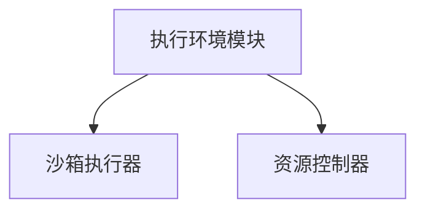
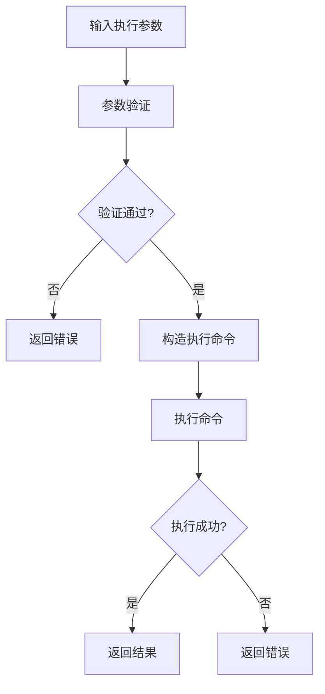
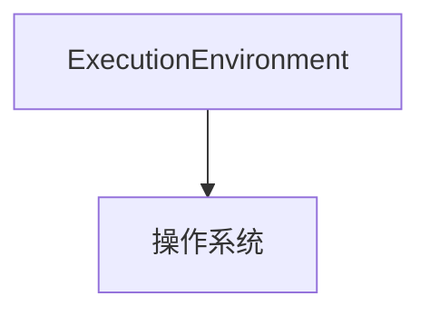

# 执行环境模块详细设计文档

## 1. 引言

### 1.1 编写目的
本文档详细描述执行环境模块的设计与实现，为开发人员提供技术参考。根据架构设计要求，执行环境模块暂时不需要复杂实现，只需要提供对应的接口，实际执行可以通过cmd调用合约来实现。

### 1.2 术语定义
- Execution Environment: 执行环境
- Contract: 智能合约
- Sandbox: 沙箱环境

## 2. 概述

### 2.1 功能概述
执行环境模块负责提供合约执行的基础环境：
- 提供基础的执行接口
- 通过命令行接口执行合约程序
- 实施基础的资源限制，防止资源耗尽攻击

### 2.2 架构图


## 3. 详细设计

### 3.1 核心数据结构

#### 3.1.1 ExecutionEnvironment 结构体
```go
type executionEnvironmentImpl struct {
    config ExecutionConfig
}
```

#### 3.1.2 ExecutionConfig 配置结构
```go
type ExecutionConfig struct {
    // 执行超时时间
    ExecutionTimeout time.Duration
    
    // 最大内存使用量
    MaxMemory uint64
    
    // 最大CPU使用率
    MaxCPU float64
}
```

### 3.2 核心接口设计

#### 3.2.1 ExecutionEnvironment 接口
```go
// ExecutionEnvironment 执行环境模块接口（简化版）
type ExecutionEnvironment interface {
    // Run 在执行环境中运行合约
    Run(contractPath string, function string, args ...interface{}) ([]byte, error)
}
```

### 3.3 核心功能实现

#### 3.3.1 执行流程


## 4. 模块实现

### 4.1 模块初始化
执行环境模块在初始化时创建实例：

```go
// NewExecutionEnvironment 创建新的执行环境实例
func NewExecutionEnvironment() ExecutionEnvironment {
    return &executionEnvironmentImpl{
        config: DefaultExecutionConfig(),
    }
}
```

### 4.2 简化执行实现
根据架构设计要求，执行环境模块采用简化的实现方式：

```go
// Run 在执行环境中运行合约
func (e *executionEnvironmentImpl) Run(contractPath string, function string, args ...interface{}) ([]byte, error) {
    // 参数验证
    if contractPath == "" {
        return nil, fmt.Errorf("contract path cannot be empty")
    }
    
    if function == "" {
        return nil, fmt.Errorf("function name cannot be empty")
    }
    
    // 构造执行命令
    // 这里使用简单的命令行调用方式
    cmd := exec.Command(contractPath, function)
    
    // 设置超时
    ctx, cancel := context.WithTimeout(context.Background(), e.config.ExecutionTimeout)
    defer cancel()
    cmd = exec.CommandContext(ctx, contractPath, function)
    
    // 执行命令
    output, err := cmd.Output()
    if err != nil {
        return nil, fmt.Errorf("failed to execute contract: %w", err)
    }
    
    return output, nil
}
```

## 5. 安全设计

### 5.1 执行环境
通过执行环境模块提供基础的执行环境：
- 通过命令行接口执行合约程序
- 实施基础的资源限制，防止资源耗尽攻击
- 提供安全的默认库接口

根据当前需求，执行器暂时不需要复杂实现，只需要有对应的接口，用cmd调用合约就行。

## 6. 性能优化

### 6.1 执行缓存
执行环境模块可以实现执行结果缓存：
- 对相同参数的执行结果进行缓存
- 支持缓存失效机制
- 提供缓存统计信息

### 6.2 并行处理
支持多个合约同时处理：
- 执行环境模块支持并行执行
- 通过对象隔离机制支持交易并行执行

## 7. 错误处理

### 7.1 错误分类
- 执行错误
- 超时错误
- 资源限制错误
- 系统错误

### 7.2 错误码设计
```go
const (
    // 执行相关错误
    ErrExecutionFailed = 3001
    ErrExecutionTimeout = 3002
    ErrFunctionNotFound = 3003
    ErrResourceLimitExceeded = 3004
    
    // 系统相关错误
    ErrSystemError = 5001
)
```

### 7.3 错误信息结构
```go
type ExecutionError struct {
    Code     int
    Message  string
    Details  string
    Err      error
}
```

## 8. 测试设计

### 8.1 单元测试
为执行环境模块编写单元测试：
- 执行功能测试
- 超时处理测试
- 错误处理测试

### 8.2 集成测试
编写集成测试验证执行环境与其他模块的协作：
- 完整合约执行流程测试
- 资源限制测试
- 异常处理测试

## 9. 部署与运维

### 9.1 配置管理
```yaml
execution:
  execution_timeout: "30s"
  max_memory: 1073741824  # 1GB
  max_cpu: 0.5  # 50%
```

### 9.2 监控指标
- 合约执行成功率
- 平均执行时间
- 资源使用情况
- 超时次数

### 9.3 日志设计
```go
type ExecutionLogger struct {
    // 日志级别
    Level LogLevel
    
    // 日志输出
    Output io.Writer
    
    // 是否启用详细日志
    Verbose bool
}
```

## 10. 与其他模块的交互

### 10.1 与虚拟机引擎的交互
执行环境模块被虚拟机引擎调用执行合约：
- 接收执行参数
- 返回执行结果
- 处理执行异常

## 11. 附录

### 11.1 接口依赖关系


### 11.2 配置示例
```go
// DefaultExecutionConfig 默认执行环境配置
func DefaultExecutionConfig() ExecutionConfig {
    return ExecutionConfig{
        ExecutionTimeout: 30 * time.Second,
        MaxMemory:        1073741824, // 1GB
        MaxCPU:           0.5,        // 50%
    }
}
```