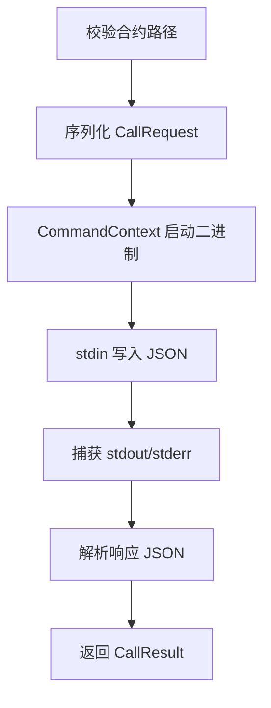

# 执行环境详细设计

## 1. 概述

当前执行环境实现为 **`Runner`**，不是历史文档中的复杂 `ExecutionEnvironment`。

MVP 实现：`ProcessRunner`（`runner.go`）。

## 2. 接口

```go
type Runner interface {
    Run(ctx context.Context, contract *CompiledContract, req CallRequest) (*CallResult, error)
}

type CallRequest struct {
    Function string        `json:"function"`
    Args     []interface{} `json:"args"`
}

type CallResult struct {
    Data        []byte
    RawResult   interface{}
    GasConsumed uint64
    Stdout      string
    Stderr      string
}
```

## 3. ProcessRunner 行为


```mermaid
flowchart TD
    A[校验合约路径] --> B[序列化 CallRequest]
    B --> C[CommandContext 启动二进制]
    C --> D[stdin 写入 JSON]
    D --> E[捕获 stdout/stderr]
    E --> F[解析响应 JSON]
    F --> G[返回 CallResult]
```

- 超时：`context` deadline 或 Runner 默认 timeout
- Gas 上限：`WithGasLimit` → 环境变量 `VM_GAS_LIMIT`
- 成功响应：`{"ok":true,"result":...,"gas":N}`
- 失败响应：`{"ok":false,"error":"...","gas":N}`

## 4. 资源限制（MVP）

| 能力 | 状态 |
|------|------|
| 执行超时 | 已实现 |
| Gas 上限 | 已实现 |
| 内存上限 | 后置 |
| 系统调用隔离 | 后置 |
| Docker | 后置 |

## 5. 可插拔演进

见 [`../sandbox_roadmap.md`](../sandbox_roadmap.md)：

- `ProcessRunner`（当前）
- `DockerRunner`（候选）
- `WASMRunner`（长期）

## 6. 测试

`runner_test.go` 覆盖：成功调用、未知函数、非法响应、非零退出、超时、Gas 超限。
