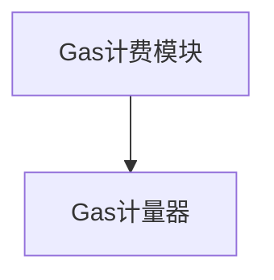
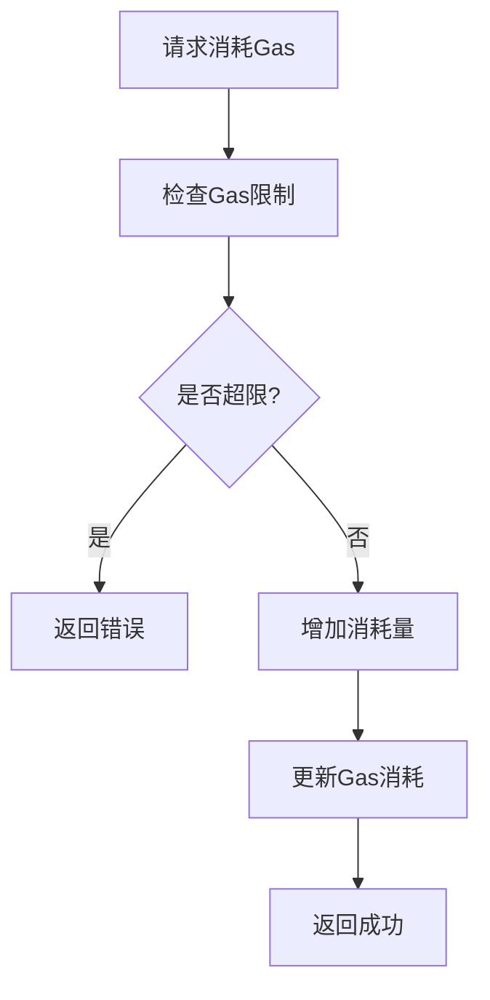
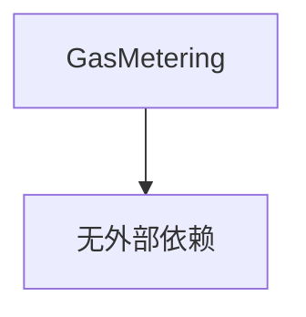

# Gas计费模块详细设计文档

## 1. 引言

### 1.1 编写目的
本文档详细描述Gas计费模块的设计与实现，为开发人员提供技术参考。根据架构设计要求，Gas计费模块采用简化实现，只负责基础的Gas计量功能。

### 1.2 术语定义
- Gas: 虚拟机执行资源的计量单位
- Gas Metering: Gas计费
- Gas Limit: Gas限制

## 2. 概述

### 2.1 功能概述
Gas计费模块负责Gas的计量和管理，防止合约执行消耗过多系统资源：
- 跟踪和控制Gas消耗
- 实施Gas限制检查
- 超限时终止执行

### 2.2 架构图


## 3. 详细设计

### 3.1 核心数据结构

#### 3.1.1 GasMetering 结构体
```go
type gasMeteringImpl struct {
    consumedGas uint64
    gasLimit    uint64
    mutex       sync.Mutex
}
```

### 3.2 核心接口设计

#### 3.2.1 GasMetering 接口
```go
// GasMetering Gas计费模块接口（简化版）
type GasMetering interface {
    // ConsumeGas 消耗Gas
    ConsumeGas(amount uint64) error
    
    // GetConsumedGas 获取已消耗的Gas
    GetConsumedGas() uint64
    
    // SetGasLimit 设置Gas限制
    SetGasLimit(limit uint64)
}
```

### 3.3 核心功能实现

#### 3.3.1 Gas消耗流程


## 4. 模块实现

### 4.1 模块初始化
Gas计费模块在初始化时创建实例：

```go
// NewGasMetering 创建新的Gas计费实例
func NewGasMetering() GasMetering {
    return &gasMeteringImpl{
        consumedGas: 0,
        gasLimit:    10000000, // 默认Gas限制
    }
}
```

### 4.2 简化实现
根据架构设计要求，Gas计费模块采用简化的实现方式：

```go
// ConsumeGas 消耗Gas
func (g *gasMeteringImpl) ConsumeGas(amount uint64) error {
    g.mutex.Lock()
    defer g.mutex.Unlock()
    
    // 检查是否超限
    if g.consumedGas+amount > g.gasLimit {
        return fmt.Errorf("gas limit exceeded: consumed %d, limit %d", g.consumedGas+amount, g.gasLimit)
    }
    
    // 增加消耗量
    g.consumedGas += amount
    return nil
}

// GetConsumedGas 获取已消耗的Gas
func (g *gasMeteringImpl) GetConsumedGas() uint64 {
    g.mutex.Lock()
    defer g.mutex.Unlock()
    
    return g.consumedGas
}

// SetGasLimit 设置Gas限制
func (g *gasMeteringImpl) SetGasLimit(limit uint64) {
    g.mutex.Lock()
    defer g.mutex.Unlock()
    
    g.gasLimit = limit
}
```

## 5. 安全设计

### 5.1 Gas计费
通过Gas计费模块防止合约执行消耗过多系统资源：
- 跟踪和控制Gas消耗
- 实施Gas限制检查
- 超限时终止执行

## 6. 性能优化

### 6.1 线程安全
Gas计费模块实现线程安全：
- 使用互斥锁保护共享数据
- 确保并发环境下的数据一致性

## 7. 错误处理

### 7.1 错误分类
- Gas超限错误
- 系统错误

### 7.2 错误码设计
```go
const (
    // Gas相关错误
    ErrGasExceeded = 3002
    
    // 系统相关错误
    ErrSystemError = 5001
)
```

### 7.3 错误信息结构
```go
type GasError struct {
    Code     int
    Message  string
    Details  string
    Err      error
}
```

## 8. 测试设计

### 8.1 单元测试
为Gas计费模块编写单元测试：
- Gas消耗功能测试
- Gas限制测试
- 错误处理测试

### 8.2 集成测试
编写集成测试验证Gas计费与其他模块的协作：
- 完整合约Gas计费流程测试
- 超限处理测试
- 异常处理测试

## 9. 部署与运维

### 9.1 配置管理
```yaml
gas:
  max_gas_limit: 10000000
```

### 9.2 监控指标
- Gas消耗情况
- Gas超限次数
- 平均Gas消耗

### 9.3 日志设计
```go
type GasLogger struct {
    // 日志级别
    Level LogLevel
    
    // 日志输出
    Output io.Writer
    
    // 是否启用详细日志
    Verbose bool
}
```

## 10. 与其他模块的交互

### 10.1 与虚拟机引擎的交互
Gas计费模块被虚拟机引擎调用进行Gas管理：
- 设置Gas限制
- 消耗Gas
- 查询Gas消耗情况

## 11. 附录

### 11.1 接口依赖关系


### 11.2 配置示例
```go
// DefaultGasLimit 默认Gas限制
const DefaultGasLimit = 10000000
```