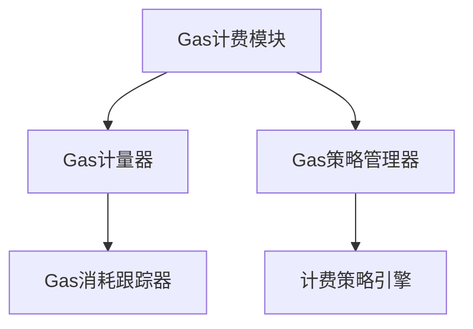
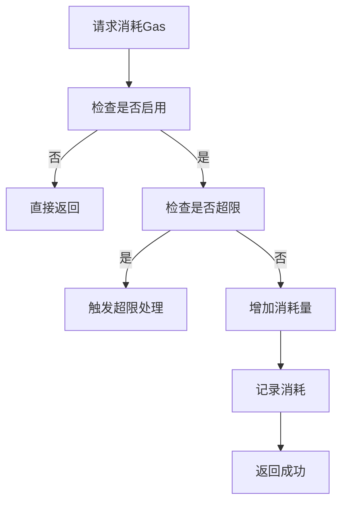
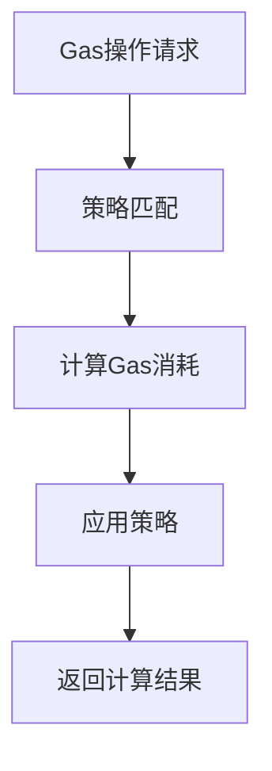
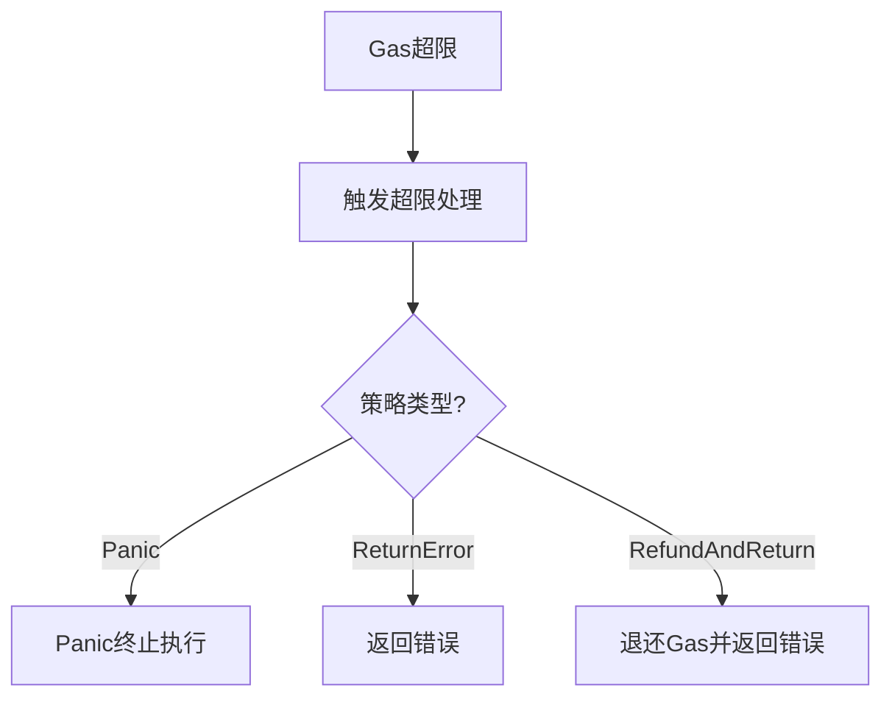
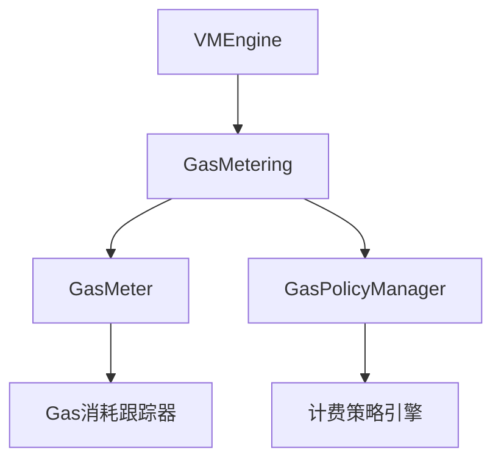

# Gas计费模块详细设计文档（更新版）

## 1. 引言

### 1.1 编写目的
本文档详细描述Gas计费模块的设计与实现，确保智能合约执行过程中资源消耗的合理控制。此版本基于模块化架构设计进行了更新。

### 1.2 术语定义
- GasMetering: Gas计费
- Gas Meter: Gas计量器
- Gas Limit: Gas限制
- Gas Price: Gas价格

## 2. 概述

### 2.1 功能概述
Gas计费模块负责跟踪和控制智能合约执行过程中的Gas消耗，包括：
- Gas消耗计量
- Gas限制检查
- Gas策略管理
- Gas消耗记录

### 2.2 架构图


## 3. 详细设计

### 3.1 核心数据结构

#### 3.1.1 GasMetering 结构体
```go
type GasMetering struct {
    config GasConfig
    meter *GasMeter
    policyManager *GasPolicyManager
}
```

#### 3.1.2 GasConfig 配置结构
```go
type GasConfig struct {
    // 是否启用Gas计量
    Enabled bool
    
    // 默认Gas价格
    DefaultPrice uint64
    
    // 是否记录详细消耗
    LogDetailedConsumption bool
    
    // 超限处理策略
    OverflowPolicy OverflowPolicy
    
    // 预留Gas比例
    ReservedGasRatio float64
}
```

#### 3.1.3 GasConsumptionRecord 消耗记录
```go
type GasConsumptionRecord struct {
    // 消耗的Gas数量
    Amount uint64
    
    // 消耗描述
    Description string
    
    // 消耗时间
    Timestamp time.Time
    
    // 消耗位置
    Location string
}
```

### 3.2 核心接口设计

#### 3.2.1 GasMetering 接口
```go
type GasMetering interface {
    // ConsumeGas 消耗Gas
    ConsumeGas(amount uint64, description string) error
    
    // RefundGas 退还Gas
    RefundGas(amount uint64, description string)
    
    // GetConsumedGas 获取已消耗的Gas
    GetConsumedGas() uint64
    
    // GetRemainingGas 获取剩余Gas
    GetRemainingGas() uint64
    
    // SetGasLimit 设置Gas限制
    SetGasLimit(limit uint64)
    
    // Enable 启用Gas计量
    Enable()
    
    // Disable 禁用Gas计量
    Disable()
    
    // Reset 重置Gas计量
    Reset()
    
    // GetConsumptionLog 获取消耗记录
    GetConsumptionLog() []GasConsumptionRecord
    
    // GetGasInfo 获取Gas信息
    GetGasInfo() *GasInfo
}
```

### 3.3 核心功能实现

#### 3.3.1 Gas消耗流程


#### 3.3.2 Gas策略管理流程


## 4. 模块设计

### 4.1 Gas计量器模块

#### 4.1.1 功能描述
负责跟踪和控制Gas消耗。

#### 4.1.2 接口设计
```go
type GasMeter interface {
    // ConsumeGas 消耗Gas
    ConsumeGas(amount uint64, description string) error
    
    // RefundGas 退还Gas
    RefundGas(amount uint64, description string)
    
    // CheckLimit 检查是否超出限制
    CheckLimit() error
    
    // GetStatus 获取状态
    GetStatus() GasMeterStatus
    
    // SetLimit 设置限制
    SetLimit(limit uint64)
}
```

#### 4.1.3 状态管理
```go
type GasMeterStatus struct {
    Enabled   bool
    Limit     uint64
    Consumed  uint64
    Remaining uint64
    Overflow  bool
}
```

### 4.2 Gas策略管理器模块

#### 4.2.1 功能描述
管理Gas计费策略和价格。

#### 4.2.2 接口设计
```go
type GasPolicyManager interface {
    // GetFunctionGasCost 获取函数Gas消耗
    GetFunctionGasCost(functionName string) uint64
    
    // GetOperationGasCost 获取操作Gas消耗
    GetOperationGasCost(operation string) uint64
    
    // GetStorageGasCost 获取存储Gas消耗
    GetStorageGasCost(operation string, size uint64) uint64
    
    // CalculateGasPrice 计算Gas价格
    CalculateGasPrice(basePrice uint64, priority int) uint64
    
    // SetPolicy 设置策略
    SetPolicy(policy GasPolicy)
}
```

#### 4.2.3 Gas消耗表
```go
// 基础操作Gas消耗
var basicOperationGasCost = map[string]uint64{
    "assign":     1,
    "arithmetic": 1,
    "comparison": 1,
    "logic":      1,
    "bitwise":    1,
}

// 函数调用Gas消耗
var functionCallGasCost = map[string]uint64{
    "BlockHeight":       1,
    "BlockTime":         1,
    "ContractAddress":   1,
    "Sender":            1,
    "Balance":           5,
    "Transfer":          20,
    "CreateObject":      50,
    "GetObject":         10,
    "DeleteObject":      10,
    "Call":              30,
    "Log":               2,
}
```

## 5. Gas计费模型

### 5.1 代码行计费
- 每行代码执行消耗1点gas
- 支持条件语句、循环语句等复杂控制流结构

### 5.2 接口操作计费
| 接口函数 | Gas消耗 |
|---------|--------|
| BlockHeight() | 1 |
| BlockTime() | 1 |
| ContractAddress() | 1 |
| Sender() | 1 |
| Balance() | 5 |
| Transfer() | 20 |
| Log() | 2 |
| CreateObject() | 50 |
| GetObject() | 10 |
| GetObjectWithOwner() | 15 |
| DeleteObject() | 10 |
| Object.Get() | 5 |
| Object.Set() | 10 |
| Object.SetOwner() | 10 |
| Call() | 30 |

### 5.3 存储操作计费
- 创建对象：50 gas
- 读取对象：10 gas
- 更新对象：10 gas
- 删除对象：10 gas
- 对象字段操作：5 gas

### 5.4 复杂计算计费
复杂计算操作通过在default library里显式指定消耗更多gas进行限制。

## 6. 超限处理策略

### 6.1 策略类型
```go
type OverflowPolicy int

const (
    PolicyPanic OverflowPolicy = iota  // 直接panic
    PolicyReturnError                  // 返回错误
    PolicyRefundAndReturn              // 退还部分Gas并返回错误
)
```

### 6.2 处理流程


## 7. 安全设计

### 7.1 防止Gas耗尽攻击
- 设置合理的Gas限制
- 预留Gas用于错误处理
- 实时监控Gas消耗

### 7.2 Gas价格机制
- 支持动态Gas价格
- 防止价格操纵
- 提供价格参考

### 7.3 Gas退还机制
- 合理的Gas退还策略
- 防止退还滥用
- 记录退还历史

## 8. 性能优化

### 8.1 计量优化
- 批量Gas消耗记录
- 异步日志记录
- 内存池管理

### 8.2 预测优化
- 缓存预测结果
- 预计算常用操作
- 动态调整预测模型

### 8.3 策略优化
- 策略缓存
- 并行策略计算
- 策略预加载

## 9. 错误处理

### 9.1 错误分类
- Gas超限错误
- 策略执行错误
- 配置错误
- 系统错误

### 9.2 错误码设计
```go
const (
    // Gas相关错误
    ErrGasLimitExceeded = 1001
    ErrGasConsumptionFailed = 1002
    ErrGasRefundFailed = 1003
    
    // 策略相关错误
    ErrInvalidPolicy = 2001
    ErrPolicyExecutionFailed = 2002
    
    // 配置相关错误
    ErrInvalidGasConfig = 3001
    ErrGasLimitTooLow = 3002
    
    // 系统相关错误
    ErrSystemError = 4001
)
```

### 9.3 错误信息结构
```go
type GasError struct {
    Code       int
    Message    string
    Limit      uint64
    Consumed   uint64
    Remaining  uint64
    Operation  string
    Err        error
}
```

## 10. 测试设计

### 10.1 单元测试
为每个Gas计费模块编写单元测试，确保功能正确性。

### 10.2 集成测试
编写集成测试，验证整个Gas计费流程的正确性。

### 10.3 性能测试
编写性能测试，验证Gas计费系统的性能指标。

### 10.4 安全测试
编写安全测试，验证Gas计费系统的安全性。

## 11. 部署与运维

### 11.1 配置管理
```yaml
gas:
  enabled: true
  default_price: 1
  log_detailed_consumption: false
  overflow_policy: "return_error"
  reserved_gas_ratio: 0.1
  limits:
    default: 10000000
    contract_deployment: 50000000
    function_call: 1000000
  costs:
    basic_operations:
      assign: 1
      arithmetic: 1
      comparison: 1
      logic: 1
      bitwise: 1
    function_calls:
      BlockHeight: 1
      BlockTime: 1
      ContractAddress: 1
      Sender: 1
      Balance: 5
      Transfer: 20
      CreateObject: 50
      GetObject: 10
      DeleteObject: 10
      Call: 30
      Log: 2
    storage_operations:
      create: 50
      read: 10
      update: 10
      delete: 10
      field_operation: 5
```

### 11.2 监控指标
- Gas消耗统计
- 超限事件统计
- 平均Gas价格
- Gas退还统计

### 11.3 性能调优
```go
type GasMeteringStats struct {
    TotalConsumedGas uint64
    TotalRefundedGas uint64
    OverflowEvents   uint64
    AverageGasPrice  float64
    PeakConsumption  uint64
}
```

## 12. 与其他模块的交互

### 12.1 与虚拟机引擎的交互
```go
// VMEngineConfig 虚拟机引擎配置
type VMEngineConfig struct {
    GasMetering        GasMetering  // Gas计费模块
    // 其他模块...
}
```

### 12.2 与执行环境模块的交互
Gas计费模块需要与执行环境模块协作，监控执行过程中的Gas消耗。

### 12.3 数据传输对象
```go
// Gas消耗请求
type ConsumeGasRequest struct {
    Amount      uint64
    Description string
    Context     GasContext
}

// Gas消耗响应
type ConsumeGasResponse struct {
    Success bool
    Error   error
    RemainingGas uint64
}
```

## 13. 附录

### 13.1 Gas策略结构
```go
type GasPolicy struct {
    // 基础操作Gas消耗
    BasicOperationCost map[string]uint64
    
    // 函数调用Gas消耗
    FunctionCallCost map[string]uint64
    
    // 存储操作Gas消耗
    StorageOperationCost map[string]uint64
    
    // 动态调整因子
    AdjustmentFactor float64
}
```

### 13.2 Gas计量器使用示例
```go
// 创建Gas计量器
meter := NewGasMeter(1000000) // 1,000,000 gas limit
meter.Enable()

// 消耗Gas
err := meter.ConsumeGas(100, "function call")
if err != nil {
    // 处理Gas超限
    return err
}

// 获取剩余Gas
remaining := meter.GetRemainingGas()

// 获取消耗记录
log := meter.GetConsumptionLog()
```

### 13.3 接口依赖关系
