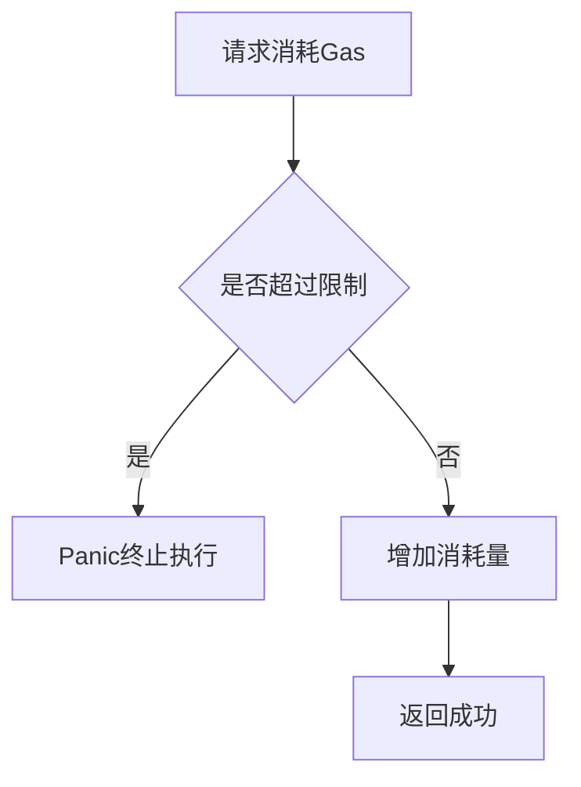
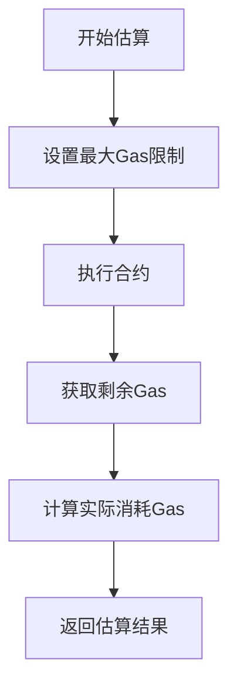
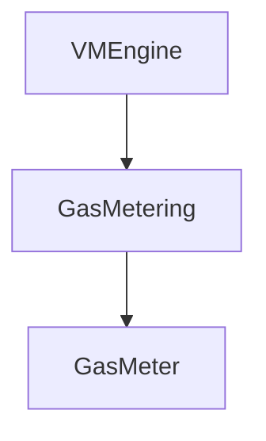

# Gas计费模块详细设计文档

## 1. 引言

### 1.1 编写目的
本文档详细描述Gas计费模块的简化设计与实现，确保智能合约执行过程中资源消耗的合理控制。

### 1.2 术语定义
- GasMetering: Gas计费
- Gas Meter: Gas计量器
- Gas Limit: Gas限制

## 2. 概述

### 2.1 功能概述
Gas计费模块负责跟踪和控制智能合约执行过程中的Gas消耗，包括：
- 设置总Gas限制
- 跟踪Gas消耗
- 超限时直接panic

## 3. 详细设计

### 3.1 核心数据结构

#### 3.1.1 GasMetering 结构体
```go
type GasMetering struct {
    meter *GasMeter
}
```

#### 3.1.2 GasMeter 结构
```go
type GasMeter struct {
    limit     uint64  // Gas限制
    consumed  uint64  // 已消耗Gas
}
```

### 3.2 核心接口设计

#### 3.2.1 GasMetering 接口
```go
// GasMetering Gas计费模块接口（与架构文档保持一致）
type GasMetering interface {
    // ConsumeGas 消耗Gas
    ConsumeGas(amount uint64, description string) error
    
    // GetConsumedGas 获取已消耗的Gas
    GetConsumedGas() uint64
    
    // GetRemainingGas 获取剩余Gas
    GetRemainingGas() uint64
    
    // SetGasLimit 设置Gas限制
    SetGasLimit(limit uint64)
}
```

### 3.3 核心功能实现

#### 3.3.1 Gas消耗流程


## 4. 模块设计

### 4.1 Gas计量器模块

#### 4.1.1 功能描述
负责跟踪和控制Gas消耗。

#### 4.1.2 接口设计
```go
type GasMeter interface {
    // ConsumeGas 消耗Gas
    ConsumeGas(amount uint64, description string) error
    
    // CheckLimit 检查是否超出限制
    CheckLimit() error
    
    // GetStatus 获取状态
    GetStatus() GasMeterStatus
    
    // SetLimit 设置限制
    SetLimit(limit uint64)
}
```

#### 4.1.3 状态管理
```go
type GasMeterStatus struct {
    Limit     uint64
    Consumed  uint64
    Remaining uint64
}
```

## 5. Gas计费模型

### 5.1 基础计费原则
Gas计费的具体实现不在本模块中，而是由接口模块负责。本模块只提供基础的Gas计量功能：
- 设置Gas限制
- 跟踪Gas消耗
- 超限时处理（panic）

### 5.2 接口模块计费
具体的Gas消耗数值由接口模块根据操作类型确定，例如：
- 基础区块链信息查询：1 Gas
- 转账操作：20 Gas
- 对象存储操作：10-50 Gas
- 跨合约调用：30 Gas

## 6. Gas估算机制

### 6.1 估算流程


### 6.2 估算实现
- 估算时将Gas限制设置为最大值
- 执行合约后，通过剩余Gas计算实际消耗
- 由上层捕获错误处理超限情况

## 7. 错误处理

### 7.1 超限处理
- 当Gas消耗超过限制时，直接panic
- 由上层调用方捕获并处理panic

### 7.2 错误信息结构
```go
type GasError struct {
    Limit      uint64
    Consumed   uint64
    Operation  string
    Err        error
}
```

## 8. 与其他模块的交互

### 8.1 与虚拟机引擎的交互
```go
// VMEngineConfig 虚拟机引擎配置
type VMEngineConfig struct {
    GasMetering        GasMetering  // Gas计费模块
    // 其他模块...
}
```

### 8.2 与执行环境模块的交互
Gas计费模块需要与执行环境模块协作，监控执行过程中的Gas消耗。

## 9. 附录

### 9.1 Gas计量器使用示例
```go
// 创建Gas计量器
meter := NewGasMeter(1000000) // 1,000,000 gas limit

// 消耗Gas
err := meter.ConsumeGas(100, "function call")
if err != nil {
    // 处理Gas超限（实际会panic）
    return err
}

// 获取剩余Gas
remaining := meter.GetRemainingGas()
```

### 9.2 接口依赖关系
