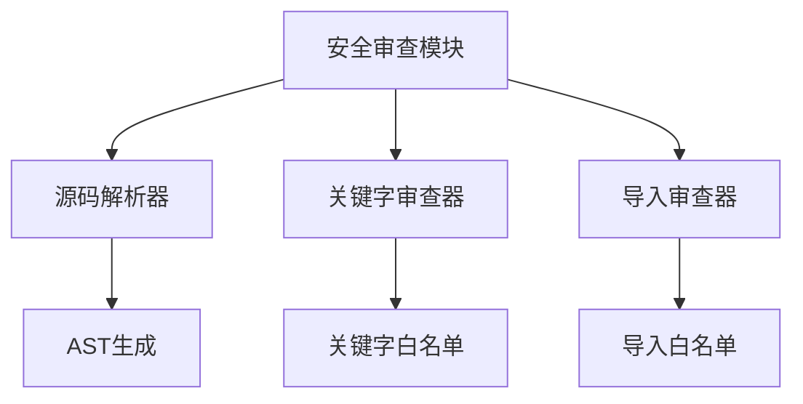
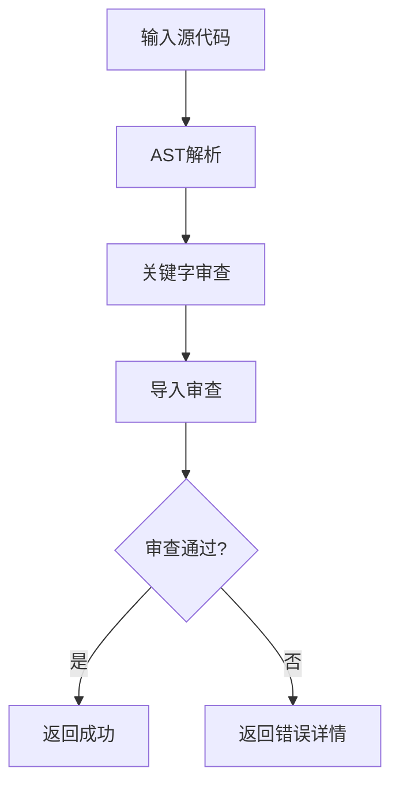
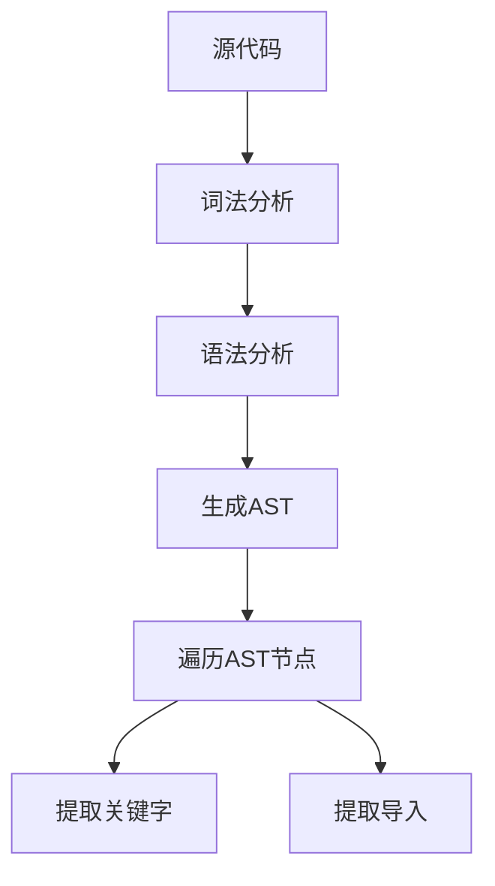
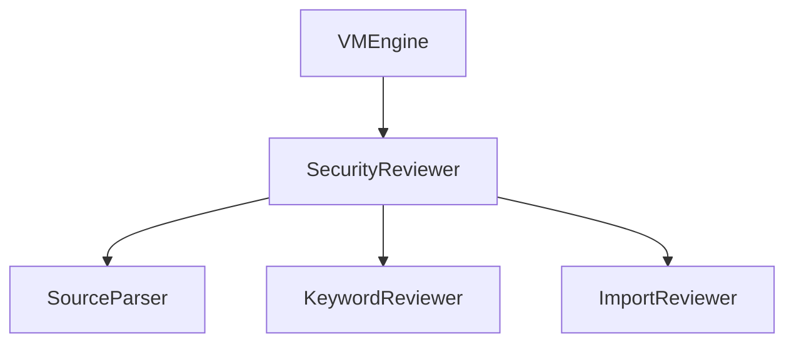

# 安全审查系统详细设计文档

## 1. 引言

### 1.1 编写目的
本文档详细描述安全审查系统的设计与实现，确保智能合约在部署和执行前符合安全规范。此版本基于模块化架构设计进行了更新。

### 1.2 术语定义
- AST: Abstract Syntax Tree，抽象语法树
- Whitelist: 白名单
- Blacklist: 黑名单
- Security Review: 安全审查

## 2. 概述

### 2.1 功能概述
安全审查系统作为独立模块负责在合约部署前对源代码进行静态分析，确保：
- 不包含禁止的关键字
- 只导入允许的包
- 符合安全编码规范

### 2.2 架构图


## 3. 详细设计

### 3.1 核心数据结构

#### 3.1.1 SecurityReviewer 结构体
```go
type SecurityReviewer struct {
    keywordWhitelist map[string]bool
    importWhitelist  map[string]bool
    config           SecurityConfig
}
```

#### 3.1.2 SecurityConfig 配置结构
```go
type SecurityConfig struct {
    // 是否启用关键字审查
    EnableKeywordReview bool
    
    // 是否启用导入审查
    EnableImportReview bool
    
    // 自定义禁止关键字
    ForbiddenKeywords []string
    
    // 自定义允许导入
    AllowedImports []string
}
```

#### 3.1.3 ReviewResult 审查结果
```go
type ReviewResult struct {
    // 审查是否通过
    Passed bool
    
    // 错误信息列表
    Errors []ReviewError
    
    // 警告信息列表
    Warnings []ReviewWarning
    
    // 审查时间
    ReviewTime time.Time
}
```

### 3.2 核心接口设计

#### 3.2.1 SecurityReviewer 接口
```go
// SecurityReviewer 安全审查模块接口（与架构文档保持一致）
type SecurityReviewer interface {
    // Review 对合约源代码进行安全审查
    Review(sourceCode string) (*ReviewResult, error)
    
    // IsKeywordAllowed 检查关键字是否被允许
    IsKeywordAllowed(keyword string) bool
    
    // IsImportAllowed 检查导入是否被允许
    IsImportAllowed(importPath string) bool
    
    // AddForbiddenKeyword 添加禁止关键字
    AddForbiddenKeyword(keyword string)
    
    // AddAllowedImport 添加允许导入
    AddAllowedImport(importPath string)
}
```

### 3.3 核心功能实现

#### 3.3.1 审查流程


#### 3.3.2 AST解析流程


## 4. 模块设计

### 4.1 源码解析器模块

#### 4.1.1 功能描述
负责将源代码解析为抽象语法树(AST)，为后续审查提供结构化数据。

#### 4.1.2 接口设计
```go
type SourceParser interface {
    // Parse 解析源代码为AST
    Parse(sourceCode string) (*ast.File, error)
    
    // ExtractKeywords 提取关键字
    ExtractKeywords(file *ast.File) []string
    
    // ExtractImports 提取导入
    ExtractImports(file *ast.File) []string
}
```

### 4.2 关键字审查器模块

#### 4.2.1 功能描述
检查源代码中是否包含禁止的关键字。

#### 4.2.2 接口设计
```go
type KeywordReviewer interface {
    // ReviewKeywords 审查关键字
    ReviewKeywords(keywords []string) []ReviewError
    
    // IsKeywordAllowed 检查关键字是否被允许
    IsKeywordAllowed(keyword string) bool
    
    // GetKeywordWhitelist 获取关键字白名单
    GetKeywordWhitelist() map[string]bool
    
    // UpdateKeywordWhitelist 更新关键字白名单
    UpdateKeywordWhitelist(whitelist map[string]bool)
}
```

### 4.3 导入审查器模块

#### 4.3.1 功能描述
检查源代码中的导入语句是否符合白名单要求。

#### 4.3.2 接口设计
```go
type ImportReviewer interface {
    // ReviewImports 审查导入
    ReviewImports(imports []string) []ReviewError
    
    // IsImportAllowed 检查导入是否被允许
    IsImportAllowed(importPath string) bool
    
    // GetImportWhitelist 获取导入白名单
    GetImportWhitelist() map[string]bool
    
    // UpdateImportWhitelist 更新导入白名单
    UpdateImportWhitelist(whitelist map[string]bool)
}
```

## 5. 白名单机制设计

### 5.1 关键字白名单

#### 5.1.1 基本类型关键字
```
int, int8, int16, int32, int64
uint, uint8, uint16, uint32, uint64
float32, float64
complex64, complex128
string, bool, byte, rune, uintptr
```

#### 5.1.2 控制流关键字
```
if, else, for, switch, case, default
break, continue, fallthrough, return
```

#### 5.1.3 其他安全关键字
```
package, import, const, var, type
func, struct, interface
nil, true, false
len, append, copy, delete, make, new
```

### 5.2 导入白名单
```
fmt          # 格式化输入输出
strconv      # 字符串转换
math         # 数学计算
time         # 时间处理
errors       # 错误处理
github.com/lengzhao/vm  # 项目默认库
```

## 6. 黑名单机制设计

### 6.1 禁止关键字
```
unsafe    # 不安全的内存操作
go        # 并发执行可能导致不确定性
select    # 与goroutine配合使用可能带来不确定性
chan      # 通道操作可能带来并发问题
goto      # 无序跳转可能带来逻辑混乱
map       # 可能导致内存使用不可控
cap       # 可能用于不确定的内存操作
```

## 7. 安全设计

### 7.1 多层审查
通过多层审查机制确保合约安全性：
1. 关键字审查
2. 导入审查

### 7.2 可配置性
支持动态配置白名单和黑名单，适应不同安全需求。

### 7.3 详细错误报告
提供详细的错误信息，帮助开发者快速定位和修复问题。

## 8. 性能优化

### 8.1 缓存机制
对已审查的源代码进行缓存，避免重复审查。

### 8.2 并行处理
支持对多个合约同时进行安全审查。

### 8.3 增量审查
只对修改的部分进行审查，提高审查效率。

## 9. 错误处理

### 9.1 错误分类
- 关键字违规错误
- 导入违规错误
- 语法错误
- 系统错误

### 9.2 错误码设计
```go
const (
    // 关键字相关错误
    ErrForbiddenKeyword = 1001
    ErrRestrictedKeyword = 1002
    
    // 导入相关错误
    ErrForbiddenImport = 2001
    ErrUnknownImport = 2002
    
    // 语法相关错误
    ErrInvalidSyntax = 3001
    ErrParseFailed = 3002
    
    // 系统相关错误
    ErrSystemError = 4001
)
```

### 9.3 错误信息结构
```go
type ReviewError struct {
    Code     int
    Message  string
    Position ast.Position // 错误位置
    Severity ErrorSeverity
}

type ReviewWarning struct {
    Code     int
    Message  string
    Position ast.Position
    Severity WarningSeverity
}
```

## 10. 测试设计

### 10.1 单元测试
为每个审查模块编写单元测试，确保审查逻辑正确性。

### 10.2 集成测试
编写集成测试，验证整个审查流程的正确性。

### 10.3 性能测试
编写性能测试，验证审查系统的性能指标。

## 11. 部署与运维

### 11.1 配置管理
通过配置文件管理白名单和黑名单。

### 11.2 监控指标
- 审查成功率
- 平均审查时间
- 违规类型统计

### 11.3 配置示例
```yaml
security:
  enable_keyword_review: true
  enable_import_review: true
  forbidden_keywords:
    - "unsafe"
    - "go"
    - "select"
    - "chan"
    - "goto"
    - "map"
    - "cap"
  allowed_imports:
    - "fmt"
    - "strconv"
    - "math"
    - "time"
    - "errors"
    - "github.com/lengzhao/vm"
```

## 12. 与其他模块的交互

### 12.1 模块初始化
安全审查模块在初始化时创建各子模块的实例：

```go
// NewSecurityReviewer 创建新的安全审查实例
func NewSecurityReviewer() SecurityReviewer {
    return &SecurityReviewer{
        keywordWhitelist: defaultKeywordWhitelist,
        importWhitelist:  defaultImportWhitelist,
        config:           DefaultSecurityConfig(),
    }
}
```

### 12.2 数据传输对象
```go
// 审查请求
type ReviewRequest struct {
    SourceCode string
}

// 审查响应
type ReviewResponse struct {
    Result *ReviewResult
    Error  error
}
```

## 13. 附录

### 13.1 默认白名单配置
```go
var defaultKeywordWhitelist = map[string]bool{
    "int": true, "int8": true, "int16": true, "int32": true, "int64": true,
    "uint": true, "uint8": true, "uint16": true, "uint32": true, "uint64": true,
    "float32": true, "float64": true, "complex64": true, "complex128": true,
    "string": true, "bool": true, "byte": true, "rune": true, "uintptr": true,
    "const": true, "var": true, "type": true, "func": true, "struct": true,
    "interface": true, "if": true, "else": true, "for": true, "switch": true,
    "case": true, "default": true, "break": true, "continue": true,
    "fallthrough": true, "return": true, "package": true, "import": true,
    "nil": true, "true": true, "false": true, "len": true, "append": true,
    "copy": true, "delete": true, "make": true, "new": true,
}

var defaultImportWhitelist = map[string]bool{
    "fmt": true,
    "strconv": true,
    "math": true,
    "time": true,
    "errors": true,
    "github.com/lengzhao/vm": true,
}
```

### 13.2 接口依赖关系
