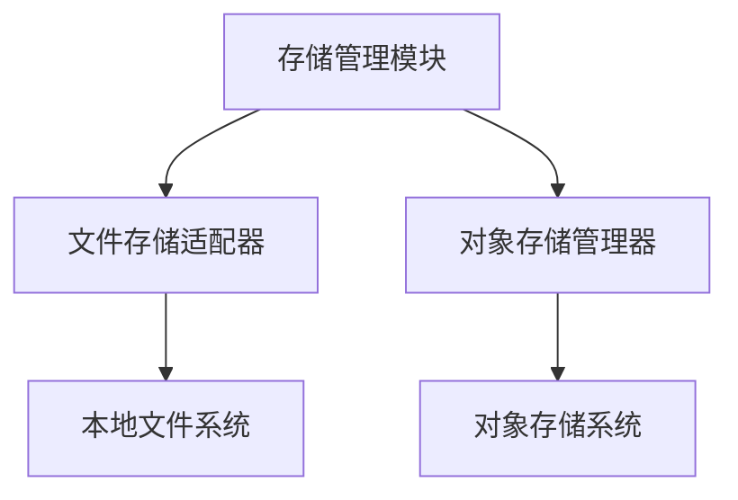
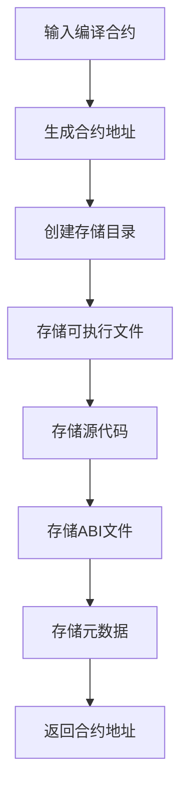
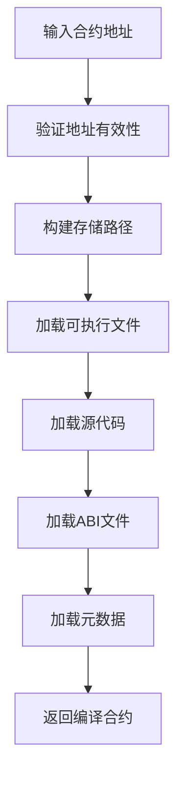
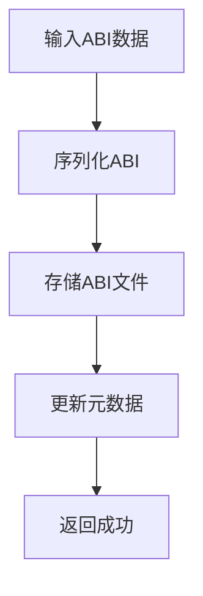
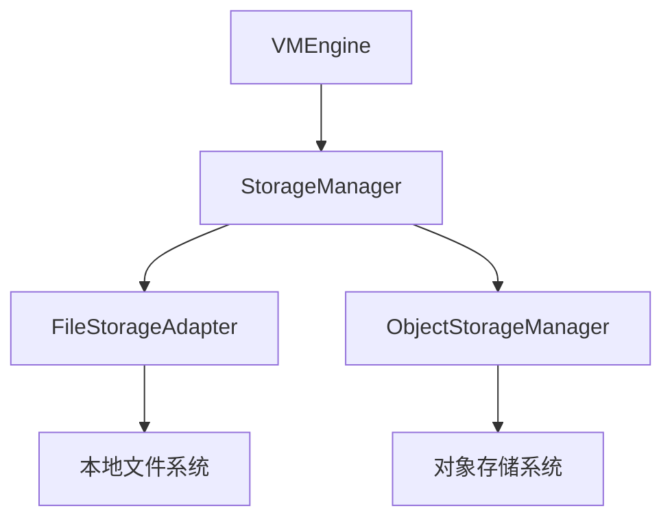

# 存储管理模块详细设计文档

## 1. 引言

### 1.1 编写目的
本文档详细描述存储管理模块的设计与实现，确保智能合约和相关数据的安全存储管理。此版本基于模块化架构设计进行了更新。

### 1.2 术语定义
- StorageManager: 存储管理器
- ContractAddress: 合约地址
- ABI: Application Binary Interface
- ObjectID: 对象标识符

## 2. 概述

### 2.1 功能概述
存储管理模块负责合约和相关数据的存储管理，包括：
- 合约存储
- ABI存储
- 存储路径管理
- 存储访问控制

对象存储系统可以由外部提供，如果外部没有提供，默认使用go-leveldb。

### 2.2 架构图


## 3. 详细设计

### 3.1 核心数据结构

#### 3.1.1 StorageManager 结构体
```go
type StorageManager struct {
    config StorageConfig
    fileAdapter *FileStorageAdapter
    objectManager *ObjectStorageManager
}
```

#### 3.1.2 StorageConfig 配置结构
```go
type StorageConfig struct {
    // 存储根目录
    StorageRoot string
    
    // 是否启用对象存储
    EnableObjectStorage bool
    
    // 文件存储配置
    FileStorageConfig FileStorageConfig
    
    // 对象存储配置
    ObjectStorageConfig ObjectStorageConfig
    
    // 存储配额 (bytes)
    StorageQuota uint64
}
```

#### 3.1.3 StorageMetadata 存储元数据
```go
type StorageMetadata struct {
    // 存储路径
    Path string
    
    // 创建时间
    CreatedAt time.Time
    
    // 更新时间
    UpdatedAt time.Time
    
    // 文件大小
    Size uint64
    
    // 校验和
    Checksum string
    
    // 权限信息
    Permissions StoragePermissions
}
```

### 3.2 核心接口设计

#### 3.2.1 StorageManager 接口
```go
// StorageManager 存储管理模块接口（与架构文档保持一致）
type StorageManager interface {
    // StoreContract 存储合约
    StoreContract(contract CompiledContract) (ContractAddress, error)
    
    // LoadContract 加载合约
    LoadContract(address ContractAddress) (CompiledContract, error)
    
    // DeleteContract 删除合约
    DeleteContract(address ContractAddress) error
    
    // StoreABI 存储ABI
    StoreABI(address ContractAddress, abi ABI) error
    
    // LoadABI 加载ABI
    LoadABI(address ContractAddress) (ABI, error)
    
    // GetContractPath 获取合约存储路径
    GetContractPath(address ContractAddress) string
}
```

### 3.3 核心功能实现

#### 3.3.1 合约存储流程


#### 3.3.2 合约加载流程


#### 3.3.3 ABI存储流程


## 4. 模块设计

### 4.1 文件存储适配器模块

#### 4.1.1 功能描述
负责合约可执行文件和ABI文件的本地文件系统存储。

#### 4.1.2 接口设计
```go
type FileStorageAdapter interface {
    // StoreFile 存储文件
    StoreFile(path string, data []byte) error
    
    // LoadFile 加载文件
    LoadFile(path string) ([]byte, error)
    
    // DeleteFile 删除文件
    DeleteFile(path string) error
    
    // FileExists 检查文件是否存在
    FileExists(path string) bool
    
    // GetFileInfo 获取文件信息
    GetFileInfo(path string) (*FileInfo, error)
}
```

#### 4.1.3 实现细节
1. 使用本地文件系统进行存储
2. 实现文件权限控制
3. 提供文件校验和验证
4. 支持大文件分块存储

### 4.2 对象存储管理器模块

#### 4.2.1 功能描述
负责智能合约对象的存储管理。

对象存储系统可以由外部提供，如果外部没有提供，默认使用go-leveldb。

#### 4.2.2 接口设计
```go
type ObjectStorageManager interface {
    // StoreObject 存储对象
    StoreObject(object Object) error
    
    // LoadObject 加载对象
    LoadObject(id ObjectID) (Object, error)
    
    // DeleteObject 删除对象
    DeleteObject(id ObjectID) error
    
    // UpdateObject 更新对象
    UpdateObject(object Object) error
    
    // ListObjects 列出对象
    ListObjects() ([]ObjectID, error)
    
    // GetObjectInfo 获取对象信息
    GetObjectInfo(id ObjectID) (*ObjectInfo, error)
}
```

#### 4.2.3 实现细节
1. 实现对象的持久化存储
2. 提供对象版本控制
3. 实现对象访问权限控制
4. 支持对象查询和索引
5. 支持外部对象存储系统的插件化集成
6. 默认使用go-leveldb作为对象存储实现

## 5. 存储结构设计

### 5.1 文件存储结构
```
storage/
├── contracts/
│   ├── {contract_address_1}/
│   │   ├── executable    # 可执行文件（可以被调用的合约程序）
│   │   ├── source.go     # 源代码（可以被import的合约模块）
│   │   ├── metadata.json # 元数据
│   │   └── abi.json      # ABI文件
│   ├── {contract_address_2}/
│   └── ...
├── objects/
│   ├── {object_id_1}.dat
│   ├── {object_id_2}.dat
│   └── ...
└── index/
    ├── contracts.idx
    └── objects.idx
```

合约部署成功后，会生成两个部分：
1. **可以被import的合约模块**：包含合约的源代码文件（source.go），供其他合约通过import语句引用和复用合约功能
2. **可以被调用的合约程序**：包含编译后的可执行二进制文件（executable），供外部系统通过虚拟机引擎调用执行

### 5.2 存储路径管理
```go
type StoragePathManager interface {
    // GetContractPath 获取合约存储路径
    GetContractPath(address ContractAddress) string
    
    // GetABIPath 获取ABI存储路径
    GetABIPath(address ContractAddress) string
    
    // GetObjectPath 获取对象存储路径
    GetObjectPath(id ObjectID) string
    
    // GenerateContractAddress 生成合约地址
    GenerateContractAddress(contract CompiledContract) ContractAddress
}
```

## 6. 安全设计

### 6.1 访问控制
```go
type StoragePermissions struct {
    // 读权限
    Read bool
    
    // 写权限
    Write bool
    
    // 执行权限
    Execute bool
    
    // 删除权限
    Delete bool
}
```

### 6.2 数据完整性
- 使用校验和确保数据完整性
- 实现数据备份机制
- 提供数据恢复功能

### 6.3 存储配额
- 实现存储配额控制
- 监控存储使用情况
- 防止存储空间耗尽

## 7. 性能优化

### 7.1 缓存机制
```go
type StorageCache struct {
    contractCache map[ContractAddress]CompiledContract
    abiCache      map[ContractAddress]ABI
    mutex         sync.RWMutex
}
```

### 7.2 索引优化
- 实现合约和对象的索引
- 支持快速查找
- 定期维护索引

### 7.3 并行访问
- 支持并发读取
- 实现写入锁机制
- 优化I/O性能

## 8. 错误处理

### 8.1 错误分类
- 存储空间不足错误
- 文件操作错误
- 权限错误
- 数据完整性错误
- 系统错误

### 8.2 错误码设计
```go
const (
    // 存储空间相关错误
    ErrStorageFull = 1001
    ErrStorageQuotaExceeded = 1002
    
    // 文件操作相关错误
    ErrFileNotFound = 2001
    ErrFileAccessDenied = 2002
    ErrFileCorrupted = 2003
    
    // 权限相关错误
    ErrPermissionDenied = 3001
    ErrInvalidPermissions = 3002
    
    // 数据完整性错误
    ErrChecksumMismatch = 4001
    ErrDataCorrupted = 4002
    
    // 系统相关错误
    ErrSystemError = 5001
    ErrIOError = 5002
)
```

### 8.3 错误信息结构
```go
type StorageError struct {
    Code     int
    Message  string
    Path     string
    Details  string
    Err      error
}
```

## 9. 测试设计

### 9.1 单元测试
为每个存储管理模块编写单元测试，确保功能正确性。

### 9.2 集成测试
编写集成测试，验证整个存储管理流程的正确性。

### 9.3 性能测试
编写性能测试，验证存储管理的性能指标。

### 9.4 安全测试
编写安全测试，验证存储管理的安全性。

## 10. 部署与运维

### 10.1 配置管理
```yaml
storage:
  storage_root: "./storage"
  enable_object_storage: true
  storage_quota: 1073741824 # 1GB
  file_storage:
    enable_compression: true
    compression_level: 6
    enable_encryption: false
  object_storage:
    enable_versioning: true
    enable_backup: true
    backup_interval: "24h"
    # 外部对象存储系统配置（可选）
    # external_provider: "s3"
    # external_config:
    #   endpoint: "https://s3.amazonaws.com"
    #   access_key: "your-access-key"
    #   secret_key: "your-secret-key"
```

### 10.2 监控指标
- 存储使用率
- 文件操作成功率
- 平均I/O延迟
- 缓存命中率
- 错误率统计

### 10.3 性能调优
```go
type StorageStats struct {
    TotalStorageUsed uint64
    FileOperations   uint64
    CacheHits        uint64
    AverageLatency   time.Duration
    ErrorCount       uint64
}
```

## 11. 与其他模块的交互

### 11.1 与虚拟机引擎的交互
```go
// VMEngineConfig 虚拟机引擎配置
type VMEngineConfig struct {
    StorageManager     StorageManager  // 存储管理模块
    // 其他模块...
}
```

### 11.2 与合约管理模块的交互
存储管理模块需要与合约管理模块协作，提供合约的持久化存储。

### 11.3 数据传输对象
```go
// 存储请求
type StoreRequest struct {
    Data      []byte
    Path      string
    Metadata  StorageMetadata
}

// 存储响应
type StoreResponse struct {
    Success bool
    Path    string
    Error   error
}
```

## 12. 附录

### 12.1 存储配置结构
```go
type FileStorageConfig struct {
    // 是否启用压缩
    EnableCompression bool
    
    // 压缩级别
    CompressionLevel int
    
    // 是否启用加密
    EnableEncryption bool
    
    // 加密密钥
    EncryptionKey string
}

type ObjectStorageConfig struct {
    // 是否启用版本控制
    EnableVersioning bool
    
    // 是否启用备份
    EnableBackup bool
    
    // 备份间隔
    BackupInterval time.Duration
    
    // 外部对象存储提供者（可选）
    ExternalProvider string
    
    // 外部对象存储配置
    ExternalConfig map[string]string
}
```

### 12.2 合约地址生成
```go
// GenerateContractAddress 生成合约地址
func (spm *StoragePathManager) GenerateContractAddress(contract CompiledContract) ContractAddress {
    // 使用源代码哈希和时间戳生成唯一地址
    hash := sha256.Sum256([]byte(contract.SourceHash + strconv.FormatInt(time.Now().Unix(), 10)))
    return ContractAddress(hex.EncodeToString(hash[:])[:32])
}
```

### 12.3 接口依赖关系
