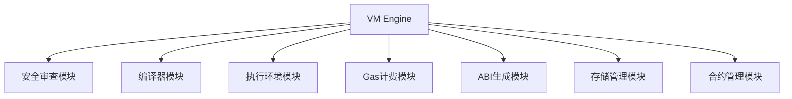
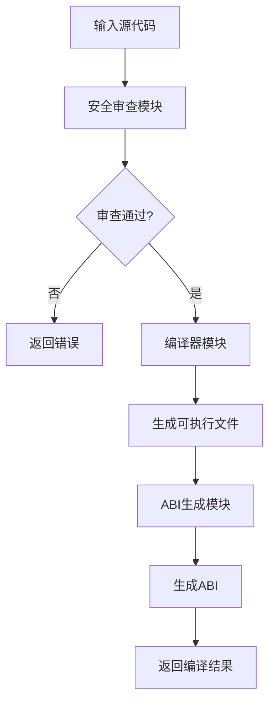
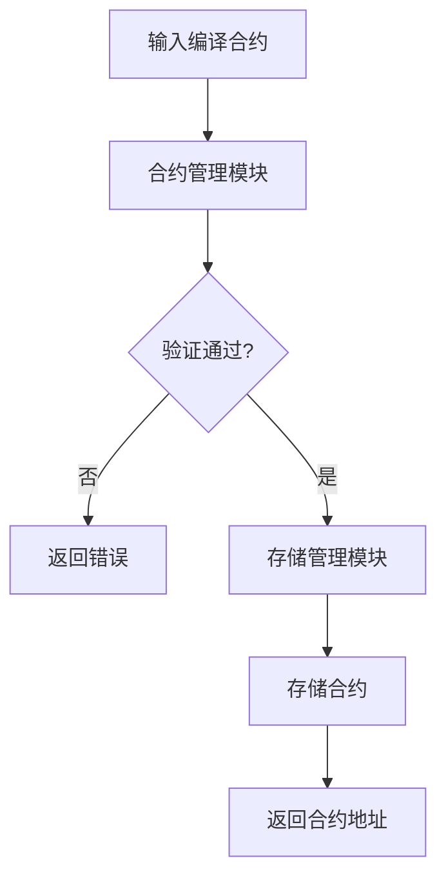
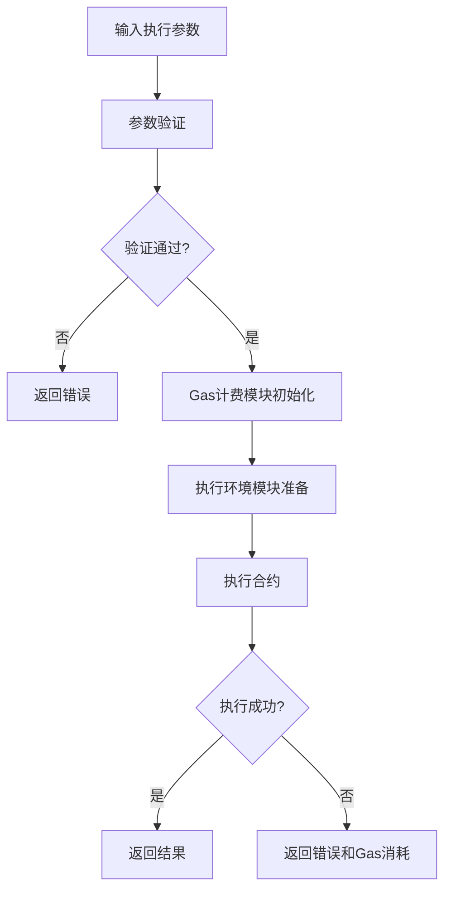
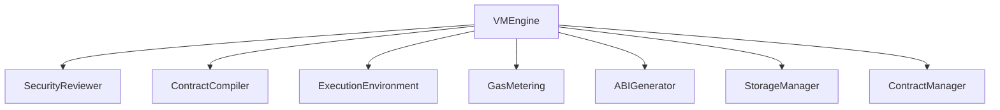

# 虚拟机执行引擎详细设计文档（更新版）

## 1. 引言

### 1.1 编写目的
本文档详细描述虚拟机执行引擎的设计与实现，为开发人员提供技术参考。此版本基于模块化架构设计进行了更新，确保与最新的系统架构保持一致。

### 1.2 术语定义
- VM Engine: 虚拟机执行引擎
- Contract: 智能合约
- Bytecode: 字节码
- Sandbox: 沙箱环境

## 2. 概述

### 2.1 功能概述
虚拟机执行引擎是整个系统的核心组件，作为协调者负责：
- 协调各功能模块的工作
- 提供统一的外部接口
- 管理模块间的依赖关系
- 提供与外部系统交互的接口

### 2.2 架构图


## 3. 详细设计

### 3.1 核心数据结构

#### 3.1.1 VMEngine 结构体
```go
type VMEngine struct {
    securityReviewer SecurityReviewer
    compiler         ContractCompiler
    executionEnv     ExecutionEnvironment
    gasMetering      GasMetering
    abiGenerator     ABIGenerator
    storageManager   StorageManager
    contractManager  ContractManager
    config           VMConfig
}
```

#### 3.1.2 VMEngineConfig 配置结构
```go
type VMEngineConfig struct {
    SecurityReviewer   SecurityReviewer
    ContractCompiler   ContractCompiler
    ExecutionEnv       ExecutionEnvironment
    GasMetering        GasMetering
    ABIGenerator       ABIGenerator
    StorageManager     StorageManager
    ContractManager    ContractManager
}
```

#### 3.1.3 VMConfig 配置结构
```go
type VMConfig struct {
    // 最大Gas限制
    MaxGasLimit uint64
    
    // 是否启用安全检查
    EnableSecurityChecks bool
    
    // 是否启用Gas计量
    EnableGasMetering bool
    
    // 执行超时时间
    ExecutionTimeout time.Duration
    
    // 合约存储目录
    ContractStorageDir string
}
```

### 3.2 核心接口设计

#### 3.2.1 VMEngine 接口
```go
type VMEngine interface {
    // Compile 编译合约源代码
    Compile(sourceCode string) (CompiledContract, error)
    
    // Deploy 部署合约
    Deploy(contract CompiledContract) (ContractAddress, error)
    
    // Execute 执行合约函数
    Execute(address ContractAddress, function string, args ...interface{}) ([]byte, error)
    
    // Call 跨合约调用
    Call(contract Address, function string, args ...any) ([]byte, error)
    
    // Stop 停止虚拟机
    Stop() error
    
    // GetContractABI 获取合约ABI
    GetContractABI(address ContractAddress) (ABI, error)
    
    // GetContractStatus 获取合约状态
    GetContractStatus(address ContractAddress) (ContractStatus, error)
    
    // GetVersion 获取虚拟机版本
    GetVersion() string
}
```

### 3.3 核心功能实现

#### 3.3.1 编译流程


#### 3.3.2 部署流程


#### 3.3.3 执行流程


## 4. 模块交互设计

### 4.1 依赖注入机制
虚拟机引擎通过依赖注入方式管理各功能模块：

```go
// NewVMEngine 创建新的虚拟机引擎实例
func NewVMEngine(config VMEngineConfig) VMEngine {
    return &vmEngineImpl{
        securityReviewer: config.SecurityReviewer,
        compiler:         config.ContractCompiler,
        executionEnv:     config.ExecutionEnv,
        gasMetering:      config.GasMetering,
        abiGenerator:     config.ABIGenerator,
        storageManager:   config.StorageManager,
        contractManager:  config.ContractManager,
    }
}
```

### 4.2 模块间数据传输

#### 4.2.1 CompiledContract 编译后的合约
```go
type CompiledContract struct {
    // 合约可执行文件路径
    ExecutablePath string
    
    // ABI信息
    ABI ABI
    
    // 编译时间
    CompileTime time.Time
    
    // Gas价格
    GasPrice uint64
    
    // 源代码哈希
    SourceHash string
    
    // 合约地址
    Address ContractAddress
}
```

#### 4.2.2 CompilationResult 编译结果
```go
type CompilationResult struct {
    // 编译后的合约
    Contract CompiledContract
    
    // 编译日志
    Logs []string
    
    // 编译是否成功
    Success bool
    
    // 错误信息
    Error error
}
```

#### 4.2.3 ExecutionResult 执行结果
```go
type ExecutionResult struct {
    // 执行结果数据
    Data []byte
    
    // Gas消耗
    GasConsumed uint64
    
    // 执行时间
    ExecutionTime time.Duration
    
    // 是否成功
    Success bool
    
    // 错误信息
    Error error
}
```

## 5. 模块设计

### 5.1 虚拟机核心引擎模块

#### 5.1.1 功能描述
作为系统的入口点和协调者，负责协调各功能模块的工作。

#### 5.1.2 接口设计
```go
type VMEngine interface {
    // Compile 编译合约源代码
    Compile(sourceCode string) (CompiledContract, error)
    
    // Deploy 部署合约
    Deploy(contract CompiledContract) (ContractAddress, error)
    
    // Execute 执行合约函数
    Execute(address ContractAddress, function string, args ...interface{}) ([]byte, error)
    
    // Stop 停止虚拟机
    Stop() error
    
    // GetContractABI 获取合约ABI
    GetContractABI(address ContractAddress) (ABI, error)
    
    // GetContractStatus 获取合约状态
    GetContractStatus(address ContractAddress) (ContractStatus, error)
    
    // GetVersion 获取虚拟机版本
    GetVersion() string
}
```

#### 5.1.3 实现细节
1. 通过依赖注入管理各功能模块
2. 协调各模块间的工作流程
3. 提供统一的外部接口
4. 处理模块间的错误传递和异常处理

## 6. 安全设计

### 6.1 输入验证
所有输入都经过严格验证，防止恶意输入导致系统异常。

### 6.2 模块隔离
通过接口抽象实现模块间隔离，降低耦合度。

### 6.3 资源限制
通过Gas计费模块限制合约执行消耗的系统资源。

## 7. 性能优化

### 7.1 模块缓存
各功能模块可实现内部缓存机制，提高性能。

### 7.2 并行执行
支持合约的并行执行以提高系统吞吐量。

### 7.3 资源复用
通过模块化设计实现资源的复用和共享。

## 8. 错误处理

### 8.1 错误分类
- 编译错误
- 部署错误
- 执行错误
- 资源错误
- 模块间通信错误

### 8.2 错误码设计
```go
const (
    // 编译相关错误
    ErrCompileFailed = 1001
    ErrInvalidSource = 1002
    
    // 部署相关错误
    ErrDeployFailed = 2001
    ErrInvalidContract = 2002
    
    // 执行相关错误
    ErrExecutionFailed = 3001
    ErrFunctionNotFound = 3002
    ErrGasExhausted = 3003
    
    // 模块相关错误
    ErrModuleNotInitialized = 4001
    ErrModuleCommunication = 4002
    
    // 资源相关错误
    ErrResourceLimitExceeded = 5001
)
```

### 8.3 错误传递机制
```go
type VMError struct {
    Code     int
    Message  string
    Module   string
    Details  string
    Err      error
}
```

## 9. 测试设计

### 9.1 单元测试
为每个模块编写单元测试，确保功能正确性。

### 9.2 集成测试
编写集成测试，验证各模块间的协作。

### 9.3 性能测试
编写性能测试，验证系统的性能指标。

### 9.4 模块化测试支持
```go
// Testable 可测试接口
type Testable interface {
    // SetupTest 测试设置
    SetupTest() error
    
    // TeardownTest 测试清理
    TeardownTest() error
    
    // RunTest 运行测试
    RunTest(testName string, testData interface{}) (interface{}, error)
}
```

## 10. 部署与运维

### 10.1 部署要求
- Go 1.16+
- TinyGo 0.20+
- Linux/Unix 环境

### 10.2 监控指标
- 合约编译成功率
- 合约部署成功率
- 合约执行成功率
- 平均执行时间
- Gas 消耗情况
- 各模块性能指标

### 10.3 配置管理
```yaml
vm:
  max_gas_limit: 10000000
  enable_security_checks: true
  enable_gas_metering: true
  execution_timeout: 30s
  contract_storage_dir: "./contracts"
```

## 11. 扩展性设计

### 11.1 插件化支持
通过接口定义实现插件化架构，支持功能模块的动态替换和扩展。

### 11.2 配置管理
通过统一的配置管理机制支持模块的灵活配置。

### 11.3 模块热插拔
支持模块的动态加载和卸载。

## 12. 附录

### 12.1 数据结构详细定义
```go
// 合约地址
type ContractAddress string

// 合约状态
type ContractStatus int

const (
    ContractStatusUnknown ContractStatus = iota
    ContractStatusDeployed
    ContractStatusSuspended
    ContractStatusDestroyed
)

// 资源限制
type ResourceLimit struct {
    MaxMemory    uint64 // 最大内存使用量 (bytes)
    MaxCPU       uint64 // 最大CPU时间 (milliseconds)
    MaxStorage   uint64 // 最大存储空间 (bytes)
    MaxNetwork   uint64 // 最大网络流量 (bytes)
}

// 资源使用情况
type ResourceUsage struct {
    MemoryUsage  uint64
    CPUUsage     uint64
    StorageUsage uint64
    NetworkUsage uint64
}
```

### 12.2 接口依赖关系
