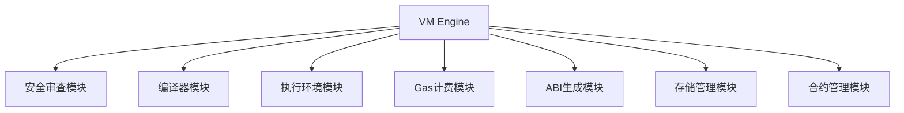
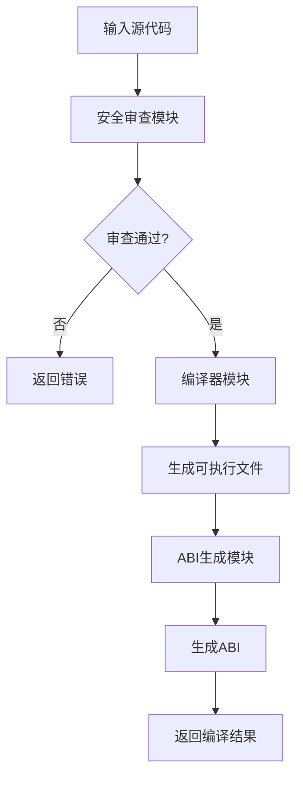
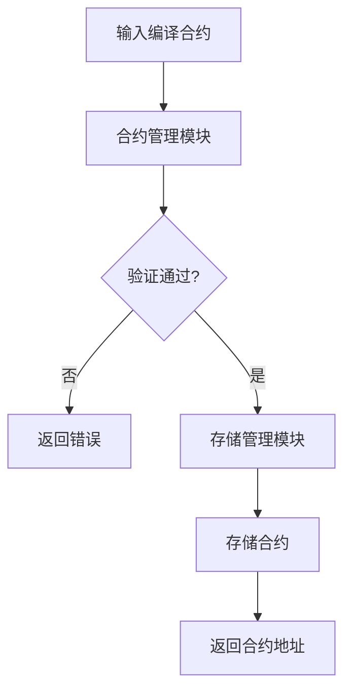
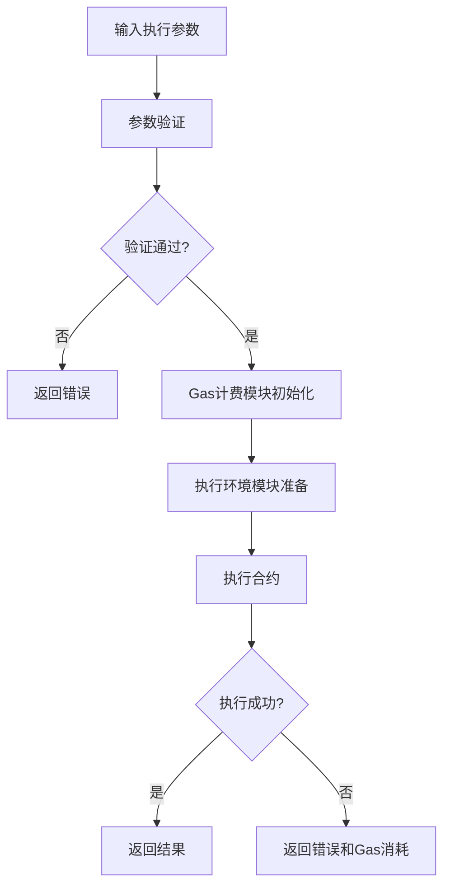
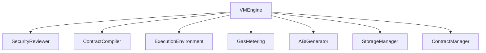

# 虚拟机执行引擎详细设计文档

## 1. 引言

### 1.1 编写目的
本文档详细描述虚拟机执行引擎的设计与实现，为开发人员提供技术参考。此版本基于模块化架构设计进行了更新，确保与最新的系统架构保持一致。

### 1.2 术语定义
- VM Engine: 虚拟机执行引擎
- Contract: 智能合约
- Bytecode: 字节码
- Sandbox: 沙箱环境

## 2. 概述

### 2.1 功能概述
虚拟机执行引擎是整个系统的核心组件，作为协调者负责：
- 协调各功能模块的工作
- 提供统一的外部接口
- 管理模块间的依赖关系
- 提供与外部系统交互的接口

### 2.2 架构图


## 3. 详细设计

### 3.1 核心数据结构

#### 3.1.1 VMEngine 结构体
```go
type VMEngine struct {
    securityReviewer SecurityReviewer
    compiler         ContractCompiler
    executionEnv     ExecutionEnvironment
    gasMetering      GasMetering
    abiGenerator     ABIGenerator
    storageManager   StorageManager
    contractManager  ContractManager
    config           VMConfig
}
```

#### 3.1.2 VMConfig 配置结构
```go
type VMConfig struct {
    // 最大Gas限制
    MaxGasLimit uint64
    
    // 是否启用安全检查
    EnableSecurityChecks bool
    
    // 是否启用Gas计量
    EnableGasMetering bool
    
    // 执行超时时间
    ExecutionTimeout time.Duration
    
    // 合约存储目录
    ContractStorageDir string
}
```

### 3.2 核心接口设计

#### 3.2.1 VMEngine 接口
```go
// VMEngine 虚拟机核心引擎接口（与架构文档保持一致）
type VMEngine interface {
    // Compile 编译合约源代码
    Compile(sourceCode string) (CompiledContract, error)
    
    // Deploy 部署合约
    Deploy(contract CompiledContract) (ContractAddress, error)
    
    // Execute 执行合约函数
    Execute(address ContractAddress, function string, args ...interface{}) ([]byte, error)
    
    // EstimateGas 估算合约调用所需的Gas
    EstimateGas(address ContractAddress, function string, args ...any) (uint64, error)
    
    // GetContractABI 获取合约ABI
    GetContractABI(address ContractAddress) (ABI, error)
    
    // GetContractStatus 获取合约状态
    GetContractStatus(address ContractAddress) (ContractStatus, error)
    
    // GetVersion 获取虚拟机版本
    GetVersion() string
}
```

### 3.3 核心功能实现

#### 3.3.1 编译流程


#### 3.3.2 部署流程


#### 3.3.3 执行流程


## 4. 模块交互设计

### 4.1 模块初始化
虚拟机引擎在初始化时创建各功能模块的实例：

```go
// NewVMEngine 创建新的虚拟机引擎实例
func NewVMEngine() VMEngine {
    return &vmEngineImpl{
        securityReviewer: NewSecurityReviewer(),
        compiler:         NewContractCompiler(),
        executionEnv:     NewExecutionEnvironment(),
        gasMetering:      NewGasMetering(),
        abiGenerator:     NewABIGenerator(),
        storageManager:   NewStorageManager(),
        contractManager:  NewContractManager(),
    }
}
```

### 4.2 模块间数据传输

#### 4.2.1 CompiledContract 编译后的合约
```go
type CompiledContract struct {
    // 合约可执行文件路径
    ExecutablePath string
    
    // ABI信息
    ABI ABI
    
    // 编译时间
    CompileTime time.Time
    
    // Gas价格
    GasPrice uint64
    
    // 源代码哈希
    SourceHash string
    
    // 合约地址
    Address ContractAddress
}
```

#### 4.2.2 CompilationResult 编译结果
```go
type CompilationResult struct {
    // 编译后的合约
    Contract CompiledContract
    
    // 编译日志
    Logs []string
    
    // 编译是否成功
    Success bool
    
    // 错误信息
    Error error
    
    // 编译时间
    CompileTime time.Duration
}
```

#### 4.2.3 ExecutionResult 执行结果
```go
type ExecutionResult struct {
    // 执行结果数据
    Data []byte
    
    // Gas消耗
    GasConsumed uint64
    
    // 执行时间
    ExecutionTime time.Duration
    
    // 是否成功
    Success bool
    
    // 错误信息
    Error error
}
```

## 5. 安全设计

### 5.1 执行环境
通过执行环境模块提供基础的执行环境：
- 通过命令行接口执行合约程序
- 实施基础的资源限制，防止资源耗尽攻击
- 提供安全的默认库接口

根据当前需求，执行器暂时不需要复杂实现，只需要有对应的接口，用cmd调用合约就行。

### 5.2 Gas计费
通过Gas计费模块防止合约执行消耗过多系统资源：
- 跟踪和控制Gas消耗
- 实施Gas限制检查
- 超限时终止执行

### 5.3 关键字审查
通过安全审查模块确保合约代码的安全性：
- 审查并禁止使用危险关键字
- 检查导入列表，仅允许导入指定的安全库
- 提供关键字白名单机制

## 6. 性能优化

### 6.1 编译缓存
编译器模块实现编译结果缓存：
- 对已编译的合约进行缓存，避免重复编译
- 使用源代码哈希作为缓存键
- 支持缓存清理机制

### 6.2 执行缓存
执行环境模块实现执行结果缓存：
- 对相同参数的执行结果进行缓存
- 支持缓存失效机制
- 提供缓存统计信息

### 6.3 并行处理
支持多个合约同时处理：
- 编译器模块支持并行编译
- 执行环境模块支持并行执行
- 通过对象隔离机制支持交易并行执行

## 7. 错误处理

### 7.1 错误分类
- 编译错误
- 部署错误
- 执行错误
- 安全审查错误
- 系统错误

### 7.2 错误码设计
```go
const (
    // 编译相关错误
    ErrCompileFailed = 1001
    ErrInvalidSourceCode = 1002
    
    // 部署相关错误
    ErrDeploymentFailed = 2001
    ErrInvalidContract = 2002
    
    // 执行相关错误
    ErrExecutionFailed = 3001
    ErrGasExceeded = 3002
    ErrFunctionNotFound = 3003
    
    // 安全审查错误
    ErrSecurityCheckFailed = 4001
    ErrForbiddenKeyword = 4002
    ErrForbiddenImport = 4003
    
    // 系统相关错误
    ErrSystemError = 5001
    ErrTimeout = 5002
)
```

### 7.3 错误信息结构
```go
type VMError struct {
    Code     int
    Message  string
    Details  string
    Err      error
}
```

## 8. 测试设计

### 8.1 单元测试
为每个核心功能编写单元测试：
- 编译功能测试
- 部署功能测试
- 执行功能测试
- 安全审查测试

### 8.2 集成测试
编写集成测试验证模块间协作：
- 完整合约处理流程测试
- 多模块协作测试
- 异常处理测试

### 8.3 性能测试
编写性能测试验证系统性能：
- 编译性能测试
- 执行性能测试
- 并发处理测试

## 9. 部署与运维

### 9.1 配置管理
```yaml
vm:
  max_gas_limit: 10000000
  enable_security_checks: true
  enable_gas_metering: true
  execution_timeout: "30s"
  contract_storage_dir: "./contracts"
```

### 9.2 监控指标
- 合约编译成功率
- 合约部署成功率
- 合约执行成功率
- 平均执行时间
- Gas消耗情况
- 各模块性能指标

### 9.3 日志设计
```go
type VMLogger struct {
    // 日志级别
    Level LogLevel
    
    // 日志输出
    Output io.Writer
    
    // 是否启用详细日志
    Verbose bool
}
```

## 10. 与其他模块的交互

### 10.1 与安全审查模块的交互
虚拟机引擎调用安全审查模块对合约源代码进行安全检查：
- 在编译前进行关键字审查
- 验证导入列表的合法性
- 提供安全审查结果

### 10.2 与编译器模块的交互
虚拟机引擎调用编译器模块将源代码编译为可执行文件：
- 提供源代码进行编译
- 获取编译结果和ABI信息
- 处理编译错误

### 10.3 与执行环境模块的交互
虚拟机引擎调用执行环境模块执行合约：
- 设置执行参数和资源限制
- 获取执行结果和Gas消耗
- 处理执行异常

## 11. 附录

### 11.1 接口依赖关系


### 11.2 数据传输对象
```go
// ContractAddress 合约地址
type ContractAddress string

// ContractStatus 合约状态
type ContractStatus int

const (
    ContractStatusUnknown ContractStatus = iota
    ContractStatusDeployed
    ContractStatusSuspended
    ContractStatusDestroyed
)

// VMVersion 虚拟机版本信息
type VMVersion struct {
    Major int
    Minor int
    Patch int
    Build string
}
```

### 11.3 配置示例
```go
// DefaultVMConfig 默认虚拟机配置
func DefaultVMConfig() VMConfig {
    return VMConfig{
        MaxGasLimit:          10000000,
        EnableSecurityChecks: true,
        EnableGasMetering:    true,
        ExecutionTimeout:     30 * time.Second,
        ContractStorageDir:   "./contracts",
    }
}
```