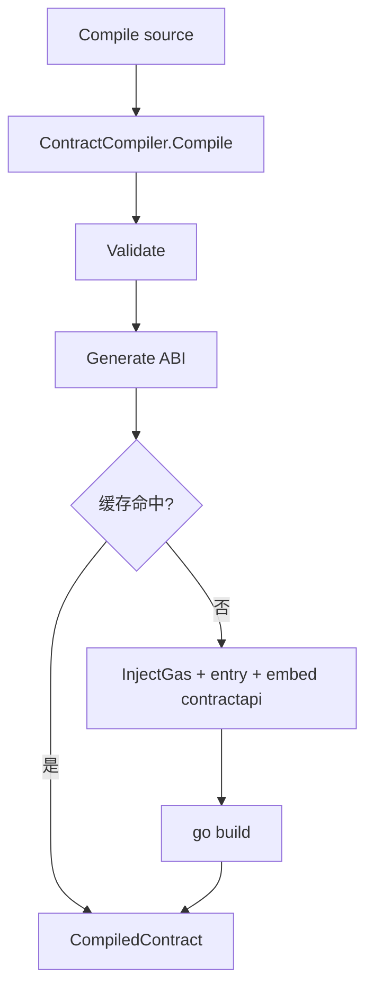
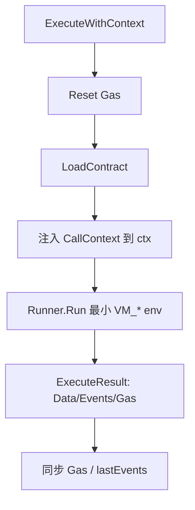

# 虚拟机执行引擎详细设计文档

## 1. 概述

`VMEngine` 是虚拟机对外入口，负责编排编译、部署与执行。自身不直接写占位可执行文件，也不内联执行逻辑。

## 2. 结构

```go
type VMEngine struct {
    config           VMConfig
    securityReviewer SecurityReviewer
    abiGenerator     ABIGenerator
    gasMetering      GasMetering
    contractManager  ContractManager
    compiler         ContractCompiler
    runner           Runner
    lastEvents       []Event // 兼容 GetLastEvents；以 ExecuteResult 为准
    mu               sync.Mutex
}
```

## 3. 编排流程

### 3.1 Compile

```mermaid
flowchart TD
    A[Compile source] --> B[ContractCompiler.Compile]
    B --> C[Validate]
    C --> D[Generate ABI]
    D --> E{缓存命中?}
    E -->|是| H[CompiledContract]
    E -->|否| F[InjectGas + entry + embed contractapi]
    F --> G[go build]
    G --> H
```

### 3.2 Deploy
1. 校验 `ExecutablePath` 存在
2. 委托 `ContractManager.Deploy`
3. 返回合约地址，并更新 `CompiledContract.Address`

### 3.3 Execute / ExecuteWithContext

```mermaid
flowchart TD
    A[ExecuteWithContext] --> B[Reset Gas]
    B --> C[LoadContract]
    C --> D[注入 CallContext 到 ctx]
    D --> E[Runner.Run 最小 VM_* env]
    E --> F[ExecuteResult: Data/Events/Gas]
    F --> G[同步 Gas / lastEvents]
```

事件以 `ExecuteResult` 自包含返回，不回放到 `Host.Log`。

## 4. 配置

```go
type VMConfig struct {
    MaxGasLimit          uint64
    EnableSecurityChecks bool
    EnableGasMetering    bool
    ExecutionTimeout     time.Duration
    ContractStorageDir   string
}
```

## 5. 与 Runner 协作
- 超时：`ExecutionTimeout`
- Gas 上限：通过 context/`VM_GAS_LIMIT` 传给子进程
- 请求/响应：JSON

## 6. 非目标（本阶段）
- EstimateGas 精确估算
- 合约升级
- Object / 跨合约 Call / 完整链状态读写
