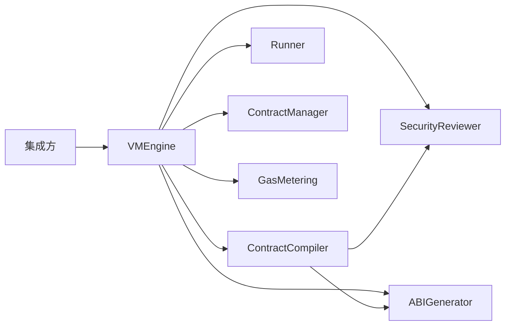

# 智能合约虚拟机模块化架构设计

## 1. 引言

### 1.1 编写目的
本文档描述当前阶段采用的模块边界：以可执行合约流水线为中心，保留必要接口，后置过度抽象。

### 1.2 设计目标
1. 打通 Compile → Deploy → Execute
2. 降低重复实现与双轨编译路径
3. 明确宿主侧与合约侧边界
4. 保持可测试、可演进

## 2. 整体架构



### 2.1 层次说明
1. **入口层**：`VMEngine`
2. **流水线层**：`ContractCompiler`（审查、ABI、Gas 注入、入口生成、构建）
3. **执行层**：`Runner`（进程超时执行）
4. **存储层**：`ContractManager`

## 3. 核心接口

### 3.1 VMEngine
对外主入口：`Compile` / `Deploy` / `Execute` / `GenerateABI` / `GetContract` / `GetContractABI`

### 3.2 ContractCompiler
- `Compile(sourceCode) (*CompiledContract, error)`
- `Validate(sourceCode) error`
- `InjectGas(sourceCode) (string, error)`

### 3.3 Runner
```go
type Runner interface {
    Run(ctx context.Context, contract *CompiledContract, req CallRequest) (*CallResult, error)
}
```

当前实现：`ProcessRunner`，使用 `exec.CommandContext`。

### 3.4 ContractManager
- `Deploy` / `GetContract` / `GetContractABI` / `StoreContract` / `LoadContract`

### 3.5 GasMetering / SecurityReviewer / ABIGenerator
保持精简核心方法；复杂策略后置。

## 4. 明确后置的模块
- 完整 `ExecutionEnvironment` 沙箱（Docker/seccomp）
- Host Runtime / 默认库链状态后端
- 配置中心、插件机制
- 并行执行调度器
- 合约升级机制

## 5. 包结构原则
- 不使用 `internal`
- 当前保持根包 `vm` + `abi`
- 后续可将合约侧默认库拆到独立包（例如 `contract` / `sdk`），避免与宿主 API 混在同一导入路径

## 6. 与实现一致性
本文档描述的是当前重构后的目标边界。若实现调整，需同步更新：
- `architecture.md`
- `detailed_design/contract_processing_flow.md`
- `detailed_design/vm_engine_detailed_design.md`
- `execution_environment.md`
