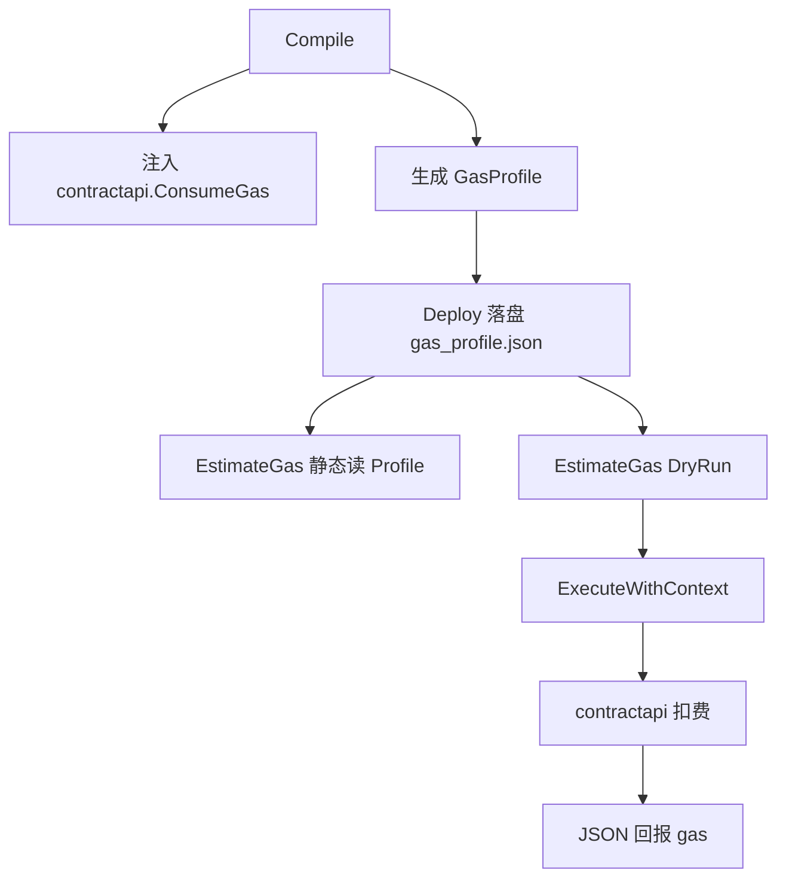

# Gas 模型推进设计（第六阶段）

日期：2026-07-21  
状态：已批准

## 1. 目标

在现有控制点计费基础上：

1. 将合约侧 Gas 统一到 `contractapi`，默认库接口真实扣费
2. Compile/Deploy 产出 `GasProfile`，支持部署后静态保守估算
3. `EstimateGas` 支持静态默认 + 可选 DryRun 实测
4. 补充基准与文档，与代码一致

**非目标：** 路径敏感分析、Object/Call/Transfer 计费、按行计费、精确迭代次数推断。

## 2. 决策摘要

| 项 | 选择 |
|----|------|
| EstimateGas | 静态保守上界 + 可选干跑 |
| contractapi 扣费 | 本阶段落地（只读上下文 + Log） |
| 实现路径 | 统一合约侧 Gas 到 contractapi + 编译期 GasProfile |
| 无源码部署后估算 | 依赖落盘 `gas_profile.json` |

## 3. 架构



| 组件 | 职责 |
|------|------|
| `contractapi` | 统一 Gas 计数器；默认库按表 `ConsumeGas` |
| Compiler | 注入改为 `contractapi.ConsumeGas`；扫描生成 Profile；bump `compilerBuildID` |
| ContractManager | Deploy 写入 `gas_profile.json`；加载合约时可取回 Profile |
| `VMEngine.EstimateGas` | 默认静态；`DryRun` 真执行取 `GasConsumed` |

## 4. API

### 宿主

```go
type EstimateOptions struct {
    DryRun   bool
    LoopBound uint64      // 静态循环上界；0 → 默认 1000
    Args     []any
    CallCtx  *CallContext
}

type GasEstimate struct {
    Estimated   uint64
    Mode        string // "static" | "dry_run"
    ProfileUsed bool
    Breakdown   map[string]uint64 // entry / funcs / loops / api
}

func (vm *VMEngine) EstimateGas(address, function string, opts *EstimateOptions) (*GasEstimate, error)
```

### 合约侧 `contractapi`

```go
func InitGas(limit uint64)
func ConsumeGas(amount uint64) // 超限 panic("gas limit exceeded")
func GasUsed() uint64
func ResetGas()
```

已有 `BlockHeight` / `BlockTime` / `Sender` / `ContractAddress` / `Log` 内部按表扣费。

入口：`InitGas` + `ConsumeGas(10)`；JSON `gas` = `GasUsed()`。  
编译注入：`contractapi.ConsumeGas(1)`，移除 entry 内本地 `__vmGas*` 双计数。

## 5. Gas 表（本阶段生效）

| 项 | Gas |
|----|-----|
| 入口基础 | 10 |
| 函数入口 / 循环迭代（注入） | 1 |
| `BlockHeight` / `BlockTime` / `Sender` / `ContractAddress` | 1 |
| `Log` | 2 |

Object / Transfer / Call 等表项保留在文档中，标为后置。

## 6. GasProfile

路径：`contracts/{address}/gas_profile.json`

```json
{
  "version": 1,
  "entry_gas": 10,
  "functions": {
    "Add": {
      "func_entries": 1,
      "loop_sites": 0,
      "api_calls": {}
    },
    "Info": {
      "func_entries": 1,
      "loop_sites": 0,
      "api_calls": { "BlockHeight": 1, "Sender": 1, "Log": 1 }
    }
  }
}
```

### 扫描规则（对原始合约源码 AST，注入前）

对每个**导出函数** `F`：

- `func_entries`：`1`（`F` 自身入口）+ `F` 体内对同包其他函数的**直接** `CallExpr` 所对应函数声明数（按名去重计入口；不做传递闭包）
- `loop_sites`：`F` 体内 `for` / `range` 节点数
- `api_calls`：`F` 体内对 `contractapi` 选择器的直接调用次数（如 `contractapi.Log`）；不计间接调用

### 静态公式

```text
LoopBound = opts.LoopBound; if 0 then 1000
Estimated = entry_gas
          + func_entries * 1
          + loop_sites * LoopBound
          + Σ(api_calls[name] * GasTable[name])
```

故意偏高；路径敏感与间接调用后置。

## 7. DryRun 语义

1. 调用 `ExecuteWithContext(address, function, callCtx, args...)`
2. 成功：`Estimated = result.GasConsumed`，`Mode = "dry_run"`
3. 失败（含 OOG）：返回 error，不伪造成功估值
4. 本阶段无 Object，无持久状态提交；事件仅存在于执行结果

## 8. 错误与兼容

| 情况 | 行为 |
|------|------|
| 无 `gas_profile.json` | 静态模式 error（需重新 Compile/Deploy） |
| 未知函数 | error |
| `opts == nil` | 等价静态 + 默认 LoopBound |
| 旧合约 | 静态不可用，需重部署（`compilerBuildID` 变更） |

## 9. 测试与基准

- `contractapi`：扣费、超限 panic、只读/Log 消耗符合表
- Profile 扫描：含循环与 `contractapi` 调用
- E2E：`EstimateGas` 静态 ≥ 同参数 DryRun；`LoopBound` 影响静态值
- 基准：`Add`、固定 N 循环、含 `Log` 的函数

## 10. 文档同步

- `docs/gas_metering.md`、`docs/detailed_design/gas_metering_detailed_design.md`
- `docs/architecture.md`、`docs/host_runtime.md`、`docs/detailed_design/contract_processing_flow.md`
- `todo.md` 第六阶段勾选已完成项
- bump `compilerBuildID`（如 `pipeline-v4-gas-profile`）

## 11. 验收标准

- [ ] `go test ./...` 通过
- [ ] 默认库调用会增加回报 `gas`
- [ ] 部署目录含 `gas_profile.json`
- [ ] `EstimateGas` 静态与 DryRun 行为符合上文
- [ ] 设计文档与代码一致
