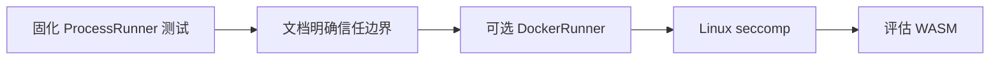

# 沙箱与可插拔 Runner 路线图

## 1. 现状

当前执行器是 `ProcessRunner`：

- 独立进程
- `context` 超时
- Gas 上限（`VM_GAS_LIMIT`）
- JSON stdin/stdout

**不提供**系统调用隔离、文件系统/网络限制。因此默认只适合可信或已审查合约。

## 2. Runner 抽象

已有接口：

```go
type Runner interface {
    Run(ctx context.Context, contract *CompiledContract, req CallRequest) (*CallResult, error)
}
```

演进实现：

| 实现 | 目标 | 优先级 |
|------|------|--------|
| ProcessRunner | 开发/CI/demo | 已实现 |
| DockerRunner | 不可信合约强隔离 | 中 |
| SeccompRunner | Linux 轻量系统调用过滤 | 中（Linux） |
| WASMRunner | 更小攻击面与跨平台 | 长期 |

## 3. 隔离策略评估

### 3.1 ProcessRunner + 安全审查（当前）
- 优点：简单、可测、跨平台
- 风险：AST 白名单可被关闭；已编译恶意二进制不受审查约束

### 3.2 Docker
- 优点：文件系统/网络隔离成熟
- 成本：依赖 Docker、启动开销大
- 适用：生产集成方可选

### 3.3 Linux seccomp / namespace
- 优点：比 Docker 轻
- 限制：macOS 开发环境不便；需平台分支

### 3.4 TinyGo / WASM
- 优点：执行面更小
- 成本：工具链与宿主 ABI 重做
- 适用：长期方向

## 4. 负例安全测试（计划）

即使在 ProcessRunner 下，也应持续验证：

1. `import "os"` / `net` / `syscall` 编译拒绝
2. `EnableSecurityChecks=true` 为默认推荐路径
3. Gas 超限与执行超时必失败
4. （沙箱落地后）禁止读写宿主文件系统、禁止出网

## 5. 实施顺序



## 6. 产品声明

在沙箱阶段完成前：

- README / 架构文档应说明：**不应用于执行不可信合约**
- 集成方若需生产隔离，应在外层自行加 Docker/VM 约束，或等待官方 Runner 实现
